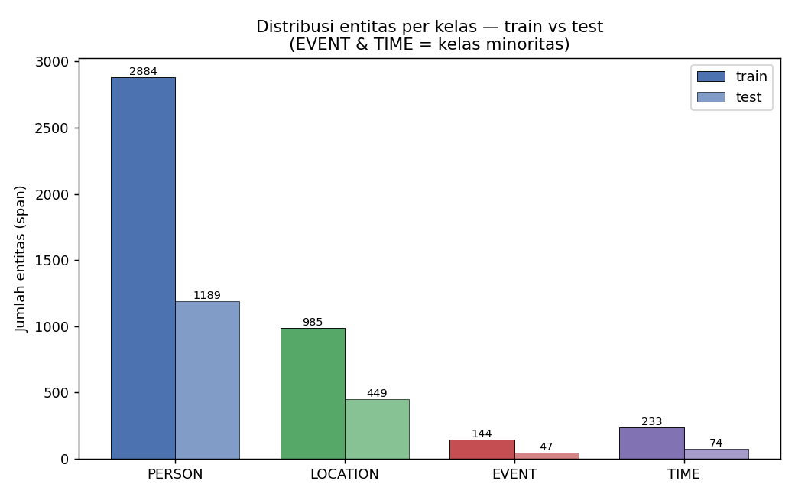
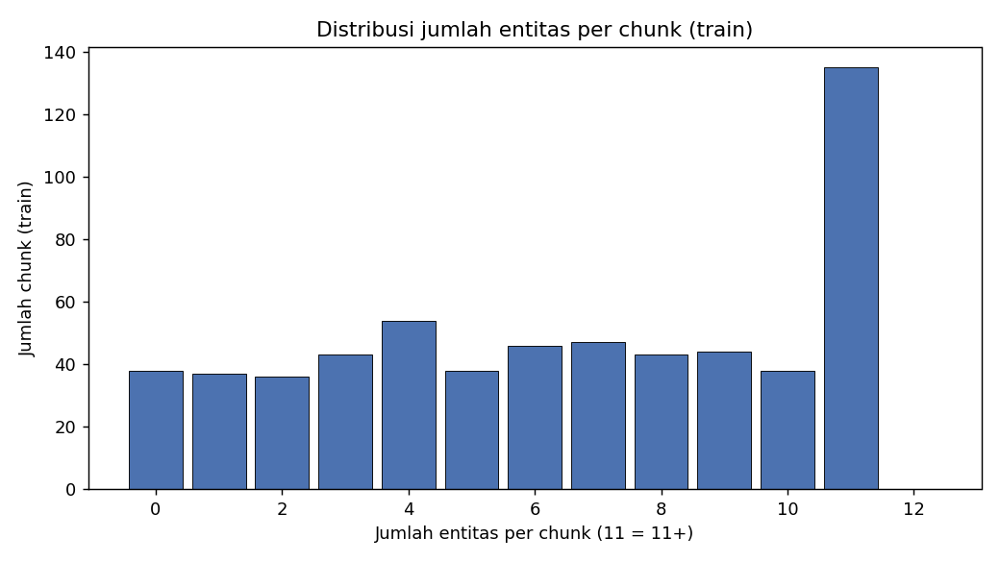

# EDA Dataset NER (SRL-NER)

> Dihasilkan oleh `src/analysis/eda_ner_dataset.py`. Menjawab revisi bimbingan 2026-06-05 (EDA + informasi dataset + tahapan pembentukan data + menampilkan data).

## A. Tahapan Pembentukan Data

Pipeline pembentukan dataset NER (dari buku cetak → data train siap model):

1. **PDF buku** Sirah Nabawiyah (Al-Mubarakfuri, terj. Kathur Suhardi, 633 hal.) → render 633 PNG halaman.
2. **OCR (PaddleOCR)** per halaman → teks mentah (`data/result/ocr_txt/page_*.txt`).
3. **Konversi CSV** → satu tabel teks per baris.
4. **Preprocessing** (pembersihan teks) → `preprocessing_result/`.
5. **Chunking** → unit **chunk** ber-`text_id` (≈ paragraf, satu chunk bisa berisi beberapa kalimat). Total 1.094 chunk.
6. **Manual labelling semi-otomatis** (regex + keyword + alias clustering) → seed berlabel BIO 4 kelas (PERSON/LOCATION/EVENT/TIME).
7. **Split** → `train.csv` (seed berlabel), `test.csv` (gold evaluasi), `unlabelled.csv` (untuk self-training).
8. **BERT iterative self-training** (THRESHOLD=0.9) → menambah label pseudo dari `unlabelled.csv` tiap iterasi.

## B. Informasi Dataset (Ukuran)

| Split | Chunk | Token | Avg token/chunk | Entitas (span) | % token entitas |
| --- | ---: | ---: | ---: | ---: | ---: |
| train | 599 | 102,884 | 171.8 | 4,246 | 7.4% |
| test | 258 | 42,558 | 165.0 | 1,759 | 7.3% |
| unlabelled | 237 | 39,207 | 165.4 | — | — |

> Catatan 1: `text_id` = **chunk** (≈ paragraf, bisa multi-kalimat), bukan kalimat tunggal. Total 1.094 chunk (599 train + 258 test + 237 unlabelled).

> Catatan 2: kolom `pos_tag` di CSV **inti** (baseline & sebagian besar skenario) memang **semua `NN` (placeholder)** — POS dimatikan. **Namun untuk skenario POS-tag tersedia varian data ber-UPOS asli** di `data/result/manual_labelling/gold_review/training_bundle_corrected_gold_20260704/data_with_pos_20260610/` (17 tag UD: NOUN/VERB/PROPN/PUNCT/…, 0 placeholder `NN`). Jadi skenario POS-tag = **ablation bersih**: satu-satunya beda vs baseline adalah kolom POS (`NN` dummy → UPOS nyata). Hasil run terkoreksi (`done_newest`): POS-tag ≈ baseline (F1 0,9430 vs 0,9420) → menambah fitur POS asli **tidak** memperbaiki di atas IndoBERT (sinyal sintaktik sudah tertangkap implisit oleh LM). Catatan lama "POS belum dipakai" hanya berlaku untuk CSV inti, **bukan** skenario POS-tag.

## C. Distribusi Label / Kelas (Bukti Imbalance)

**train** (total 4,246 entitas span):

| Kelas | Entitas (span) | % dari entitas | Token (B+I) |
| --- | ---: | ---: | ---: |
| PERSON | 2,884 | 67.9% | 5,559 |
| LOCATION | 985 | 23.2% | 1,057 |
| EVENT | 144 | 3.4% | 300 |
| TIME | 233 | 5.5% | 666 |

> Rasio imbalance (kelas terbanyak : tersedikit) ≈ **20.0 : 1**.

**test** (total 1,759 entitas span):

| Kelas | Entitas (span) | % dari entitas | Token (B+I) |
| --- | ---: | ---: | ---: |
| PERSON | 1,189 | 67.6% | 2,302 |
| LOCATION | 449 | 25.5% | 475 |
| EVENT | 47 | 2.7% | 100 |
| TIME | 74 | 4.2% | 232 |

> Rasio imbalance (kelas terbanyak : tersedikit) ≈ **25.3 : 1**.

## D. Statistik Level Chunk (train)

- Chunk tanpa entitas sama sekali: **38 / 599 (6.3%)**
- Rata-rata entitas per chunk: **7.09**
- Maksimum entitas dalam satu chunk: **25**

Jumlah chunk (train) yang mengandung minimal 1 entitas tiap tipe:

| Kelas | Jumlah chunk |
| --- | ---: |
| PERSON | 528 |
| LOCATION | 345 |
| EVENT | 95 |
| TIME | 114 |

## E. Menampilkan Data (Contoh Berlabel)

Format: token biasa ditulis apa adanya; entitas ditandai `[TIPE: teks]`.

**Contoh entitas PERSON:**

- Untuk itu beliau bersabda, "Dari Yamamah ini, akan muncul seorang pendusta yang membual sebagai nabi. Dia akan menjadi pembunuh sepeninggalku." Ada seseorang yang bertanya, "Wahai [PERSON: Rasulullah,] siapakah yang dibu- nuhnya?" Beliau menjawab, "Kamu dan rekan-rekanmu." Dan memang begitulah yang
- Dari tempat ini ke [LOCATION: Madinah] bisa ditempuh dengan berjalan kaki selama sepuluh hari. [PERSON: Ibnu Ishaq] menyebutkan bahwa orang-orang Muslim bermarkas di sebuah mata air di wilayah Judzam yang disebut As-Salasil, hingga peperangan ini disebut Dzatus

**Contoh entitas LOCATION:**

- Dari tempat ini ke [LOCATION: Madinah] bisa ditempuh dengan berjalan kaki selama sepuluh hari. [PERSON: Ibnu Ishaq] menyebutkan bahwa orang-orang Muslim bermarkas di sebuah mata air di wilayah Judzam yang disebut As-Salasil, hingga peperangan ini disebut Dzatus
- Setelah persiapan dirasa cukup, pasukan [LOCATION: Makkah] mulai bergerak menuju [LOCATION: Madinah.] Hati mereka bergolak karena dendam kesumat dan kebencian yang ditahan-tahan sekian lama, siap diledakkan dalam peperangan yang dahyat.

**Contoh entitas EVENT:**

- Padahal pensyariatan shalat khauf yang pertama kali terjadi pada saat [EVENT: Perang Asafan.] Sementara itu, tidak ada perbedaan pendapat bahwa [EVENT: Perang Asafan] terjadi setelah [EVENT: Perang Khandaq,] yang terjadi pada akhir tahun

**Contoh entitas TIME:**

- Bapaknya adalah pemimpin Bani Mushthaliq dari Khuza'ah. Tadinya [PERSON: Juwairiyah] ada di antara para tawanan Bani Mushthaliq, yang kemudian menjadi bagian [PERSON: Tsabit bin Qais bin Syammas.] Lalu [PERSON: Rasulullah] menebus dirinya dan menikahinya pada [TIME: bulan Sya'ban 6 H.]
- Dia berasal dari Bani Israil, yang sebelumnya dia salah seorang dari tawanan [LOCATION: Khaibar.] Lalu [PERSON: Rasulullah] memilihnya untuk diri beliau sendiri. membebaskannya dan menikahinya setelah penaklukkan [LOCATION: Khaibar] pada [TIME: tahun 7 H.]

## F. Ringkasan untuk Pembahasan

- Kelas **paling sedikit** (test): **EVENT** (47 entitas) dan **TIME** (74 entitas).
- Ini sejalan dengan F1 per-kelas terendah pada EVENT & TIME (lihat `error_analysis_ner.md`).
- Imbalance + jumlah contoh sedikit → hipotesis utama penyebab performa rendah, yang diuji lebih lanjut di error analysis.
