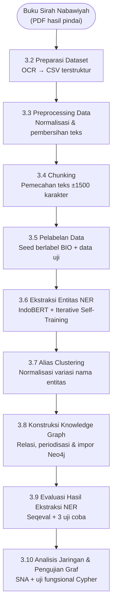

# BAB 3 METODOLOGI

> **[CATATAN PENYUSUN, hapus saat finalisasi]**
> Bab 3 ini ditulis ulang mengikuti susunan buku teman: **3.1 Perancangan Sistem** (flowchart garis besar + spesifikasi perangkat keras dan lunak), lalu **3.2 dan seterusnya** memuat tiap tahap pada flowchart, masing-masing berisi penjelasan alur, *pseudocode* (format BEGIN...END dengan INPUT dan OUTPUT), contoh hasil, dan penjelasan atribut/komponen data.
> Tiga koreksi penting dari draft lama (`../archive/bab3_lengkap_revisi_USANG.md` — diarsipkan 2026-07-10, `bab3_revisi_paragraf.md`): (1) **skenario LLM-NER dan dua graf (Graf A/Graf B) dihapus**, sistem hanya membangun satu *knowledge graph* (keputusan pembimbing 3 Mei 2026); (2) ***pseudocode* NER ditulis sesuai implementasi nyata**, yaitu IndoBERT *token classification* BIO dengan *iterative self-training*, bukan *parsing* SRL/Stanza dengan pemetaan ARG0/ARGM yang ada di draft lama (draft lama mengarang langkah yang tidak ada di kode); (3) tahap **alias clustering, periodisasi, dan Social Network Analysis** dimasukkan sebagai tahap penuh agar konsisten dengan ruang lingkup Bab 1 dan Bab 2.
> Patuh pedoman: tanpa em dash, bahasa *layman*, istilah asing *italic*, sitasi APA. Tanda **[PERIKSA]** = perlu konfirmasi pembimbing; **[SITASI: ...]** = referensi yang perlu masuk Daftar Pustaka.
> Pembimbing: Dini Adni Navastara, S.Kom., M.Sc.; ko-pembimbing: Ratih Nur Esti Anggraini, S.Kom., M.Sc., Ph.D.

Bab ini menguraikan metodologi penelitian secara rinci. Subbab 3.1 menyajikan perancangan sistem secara garis besar, yaitu diagram alir keseluruhan metodologi beserta spesifikasi perangkat keras dan perangkat lunak yang digunakan. Subbab 3.2 sampai 3.10 menjelaskan setiap tahap pada diagram alir tersebut secara detail, dilengkapi *pseudocode*, contoh hasil, dan penjelasan komponen data pada tiap tahap.

## 3.1 Perancangan Sistem

Penelitian ini bertujuan membangun *knowledge graph* Sirah Nabawiyah berbahasa Indonesia dari teks naratif menggunakan *Named-Entity Recognition* (NER) berbasis SRL dengan strategi *iterative self-training*, lalu menyimpannya pada Neo4j dan menganalisisnya dengan *Social Network Analysis* (SNA). Secara garis besar, sistem terdiri dari rangkaian tahap berikut: preparasi *dataset* dari dokumen Sirah, *preprocessing* untuk membersihkan *noise* hasil OCR, *chunking* untuk memecah teks menjadi unit kecil yang tetap mempertahankan konteks, pelabelan data sebagai *seed* sekaligus data acuan (*ground truth*), ekstraksi entitas dengan NER berbasis SRL (yang hasilnya digabungkan dengan anotasi manual untuk membentuk cakupan entitas seluruh korpus), penyatuan variasi nama entitas (*alias clustering*), konstruksi *knowledge graph* (pembentukan relasi, periodisasi peristiwa, dan impor ke Neo4j), evaluasi hasil ekstraksi NER, serta analisis jaringan dengan SNA dan pengujian fungsional graf. Diagram alir keseluruhan metodologi ditunjukkan pada Gambar 3.1.



**Gambar 3.1** Diagram Alir Keseluruhan Metodologi

Tiap tahap pada diagram alir di atas diuraikan secara rinci pada subbab 3.2 sampai 3.10, masing-masing dilengkapi *pseudocode*, contoh hasil, dan penjelasan komponen data. Penelitian ini menggunakan dua lingkungan komputasi: komputer lokal untuk sebagian besar tahap pengolahan data, dan Google Colab dengan GPU untuk pelatihan model NER. Spesifikasi perangkat keras komputer lokal ditunjukkan pada Tabel 3.1.

[SISIPKAN TABEL 3.1 - Spesifikasi Perangkat Keras]

| Komponen | Spesifikasi |
|----------|-------------|
| Prosesor | Intel Core i7-8750H @ 2.20GHz |
| RAM | 16 GB |
| Penyimpanan | 1 TB |
| GPU | Opsional (lihat keterangan) |

Khusus untuk pelatihan model NER berbasis IndoBERT yang membutuhkan akselerasi *Graphics Processing Unit* (GPU), proses pelatihan dijalankan pada lingkungan komputasi awan Google Colab dengan GPU NVIDIA Tesla T4. Tahap selain pelatihan model dapat berjalan pada CPU komputer lokal, sehingga kebutuhan GPU pada komputer lokal bersifat opsional. <!-- [PERIKSA] sebutkan spesifikasi GPU Colab yang dipakai persis (T4) sesuai catatan run; sesuaikan bila memakai lingkungan lain. -->

Seluruh proses diimplementasikan menggunakan bahasa pemrograman Python pada lingkungan *Jupyter Notebook* untuk memudahkan eksperimen bertahap dan pencatatan keluaran tiap modul. Daftar perangkat lunak dan pustaka utama ditunjukkan pada Tabel 3.2.

[SISIPKAN TABEL 3.2 - Spesifikasi Perangkat Lunak]

| Komponen | Nama Perangkat Lunak | Spesifikasi | Fungsi |
|----------|----------------------|-------------|--------|
| Bahasa pemrograman | Python | Versi 3.10.6 | Bahasa utama implementasi seluruh tahap pipeline |
| Lingkungan kerja | Jupyter Notebook, Google Colab | Colab dengan GPU NVIDIA Tesla T4 | Eksekusi eksperimen bertahap dan pelatihan model dengan akselerasi GPU |
| OCR | PaddleOCR | Versi 2.7.0.3, konfigurasi Bahasa Indonesia | Mengekstraksi teks dari citra hasil pindai halaman PDF |
| Konversi PDF ke citra | PyMuPDF, Pillow | PyMuPDF 1.20.2, Pillow 10.0.0 | Mengubah tiap halaman PDF menjadi citra untuk diproses OCR |
| Pemodelan NER | PyTorch, Hugging Face Transformers, IndoBERT | PyTorch 2.12.0, Transformers 5.9.0, model `indolem/indobert-base-uncased` | Melatih dan menjalankan model NER berbasis IndoBERT |
| Evaluasi NER | seqeval, scikit-learn | seqeval 1.2.2, scikit-learn 1.7.2 | Menghitung metrik evaluasi entitas (presisi, recall, F1) |
| Pengolahan data | pandas, numpy | pandas 2.3.3, numpy 1.23.5 | Manipulasi dan pengolahan data tabular antar tahap |
| Pencocokan string (alias) | jellyfish | Algoritma Jaro-Winkler | Mengelompokkan variasi penulisan nama entitas (alias clustering) |
| Basis data graf | Neo4j Desktop | Bahasa kueri Cypher | Menyimpan dan mengueri Knowledge Graph |
| Penghubung Neo4j-Python | Pustaka `neo4j` | Protokol Bolt | Menghubungkan skrip Python dengan basis data Neo4j |
| Analisis jaringan | NetworkX, python-louvain | NetworkX 3.4.2 | Analisis jaringan sosial (sentralitas, deteksi komunitas) |
| Utilitas | regex, tqdm | regex 2026.5.9, tqdm 4.67.1 | Pencocokan pola teks dan penampil progres proses |

Seluruh keluaran antar tahap, seperti hasil OCR per halaman, dokumen terstruktur, *dataset* CSV, *seed* berlabel, prediksi NER, daftar *node* dan *edge*, serta skrip Cypher, disimpan sebagai berkas terpisah pada folder `data/result/` agar alur kerja dapat direplikasi dan dievaluasi ulang.

## 3.2 Preparasi Dataset

Tahap preparasi *dataset* bertujuan mengubah dokumen Sirah Nabawiyah berformat PDF hasil pindai menjadi *dataset* teks terstruktur yang siap diolah. Sumber data adalah buku *Sirah Nabawiyah* karya Syaikh Shafiyyurrahman Al-Mubarakfuri (terjemahan Kathur Suhardi) sebanyak sekitar 633 halaman dalam Bahasa Indonesia. <!-- [PERIKSA] cocokkan judul, penerjemah, dan jumlah halaman dengan sampul buku. --> Diagram alir tahap ini ditunjukkan pada Gambar 3.2.

[SISIPKAN GAMBAR 3.2 - Diagram Alir Preparasi Dataset]

**Komposisi dan bentuk data.** Dokumen Sirah Nabawiyah berupa berkas PDF hasil pindai (*scan*) sehingga tidak memiliki lapisan teks digital. Setiap halaman PDF terlebih dahulu dirender menjadi citra, kemudian diekstraksi teksnya menggunakan PaddleOCR berkonfigurasi Bahasa Indonesia. Hasil OCR disimpan sebagai berkas teks polos per halaman dengan pola penamaan `page_[nomor].txt`. Dengan demikian, data masukan tahap ini terdiri atas dua komponen: (1) kumpulan berkas teks per halaman (`.txt`) hasil OCR, dan (2) berkas daftar isi acuan (*ground truth*) berformat JSON (`toc_groundtruth.json`) yang memuat judul bab dan sub-bab beserta halaman mulainya. Kedua komponen ini menjadi masukan bagi dua langkah utama tahap preparasi, yaitu ekstraksi dokumen terstruktur dan konversi ke berkas CSV.

**Ekstraksi dokumen.** Pada langkah ini, kumpulan teks per halaman disusun kembali mengikuti struktur dokumen berdasarkan daftar isi (*Table of Contents*). Pertama, daftar isi diubah menjadi indeks pencarian berbentuk peta dari nomor halaman ke kumpulan judul bab/sub-bab yang dimulai pada halaman tersebut. Selanjutnya, setiap berkas halaman dibaca secara berurutan; bagian *footer* berulang seperti teks "Sirah Nabawiyah", kata "halaman", dan nomor halaman pada dua baris terakhir dihapus. Setiap baris kemudian diuji apakah merupakan judul bab atau sub-bab dengan mencocokkannya ke indeks daftar isi melalui *exact matching* lalu *fuzzy matching* (rasio kemiripan *string* dengan ambang 0,92). Karena OCR dapat memecah satu judul menjadi beberapa baris, kandidat judul dibentuk dari gabungan satu sampai tiga baris berurutan. Bila sebuah baris cocok sebagai judul, ia membuka konteks bab atau sub-bab baru; bila tidak, baris diperlakukan sebagai paragraf isi dan dilekatkan pada sub-bab yang sedang aktif. Setelah seluruh halaman diproses, isi tiap sub-bab digabung menjadi satu rangkaian teks. *Pseudocode* langkah ini ditunjukkan pada Kode Semu 3.1.

[SISIPKAN KODE SEMU 3.1 - Ekstraksi Dokumen]

```
INPUT  : ocr_dir   (folder berkas teks OCR per halaman, page_[nomor].txt)
         toc_data  (daftar isi acuan: judul bab/sub-bab + halaman mulai)
OUTPUT : document  (dokumen terstruktur JSON: bab -> sub-bab -> teks)

ALGORITMA:
1.  BEGIN
2.      toc_index <- BuildTocIndex(toc_data)        // peta: halaman -> {judul ternormalisasi -> (tipe, judul asli)}
3.      document <- [] ; current_bab <- NULL ; current_subbab <- NULL
4.      FOR EACH file IN SortByPageNumber(ocr_dir) DO
5.          page  <- ParsePageNumber(file)
6.          lines <- ReadNonEmptyLines(file)
7.          lines <- StripFooter(lines)             // buang "Sirah Nabawiyah", "halaman", nomor halaman
8.          i <- 0
9.          WHILE i < LENGTH(lines) DO
10.             candidates <- BuildCandidates(lines, i)                   // gabungan 1-3 baris
11.             match      <- BestTocMatch(candidates, page, toc_index)   // exact lalu fuzzy (ratio >= 0.92)
12.             IF match <> NULL THEN
13.                 IF match.type = "BAB" THEN
14.                     current_bab <- {bab_title: match.title, subbab: []}
15.                     document.APPEND(current_bab) ; current_subbab <- NULL
16.                 ELSE IF match.type = "SUBBAB" THEN
17.                     current_subbab <- {subbab_title: match.title, content: [], pages: [page]}
18.                     current_bab.subbab.APPEND(current_subbab)
19.                 END IF
20.                 i <- i + match.lines_used
21.             ELSE
22.                 EnsureActiveBabSubbab(current_bab, current_subbab)    // buat penampung bila belum ada
23.                 current_subbab.content.APPEND(lines[i])
24.                 AddPageIfNew(current_subbab.pages, page)
25.                 i <- i + 1
26.             END IF
27.         END WHILE
28.     END FOR
29.     document <- MergeContentPerSubbab(document)   // gabung baris konten jadi satu teks per sub-bab
30.     SaveJSON(document, "document_full.json")
31.     RETURN document
32. END
```

Kode Semu 3.1 menunjukkan tahapan umum penyusunan kembali teks hasil OCR per halaman menjadi dokumen terstruktur. Proses dimulai dengan menyiapkan indeks daftar isi agar pencocokan judul cukup dilakukan pada kandidat yang seharusnya muncul di halaman bersangkutan, kemudian membaca tiap berkas halaman secara berurutan dan membuang baris *footer* berulang. Setiap baris lalu diuji sebagai kandidat judul yang dibentuk dari gabungan satu sampai tiga baris dan dicocokkan ke daftar isi secara persis terlebih dahulu, baru secara samar dengan ambang 0,92. Bila baris terdeteksi sebagai judul, tipe `BAB` membuka konteks bab baru sedangkan tipe `SUBBAB` membuka sub-bab baru di bawah bab aktif; bila tidak, baris diperlakukan sebagai isi sub-bab aktif sekaligus mencatat nomor halaman sumbernya. Setelah seluruh halaman selesai diproses, potongan isi tiap sub-bab digabung menjadi satu teks utuh dan disimpan sebagai berkas JSON. Hasil akhir dari proses ini berupa dokumen terstruktur yang memuat hierarki bab, sub-bab, isi teks, dan daftar halaman sumber. Dengan demikian, keluaran langkah ini tidak hanya merepresentasikan teks mentah hasil OCR, tetapi juga keterhubungannya dengan struktur dokumen asli sehingga konteks tiap bagian Sirah tetap terjaga.

Keluaran langkah ekstraksi adalah dokumen terstruktur berformat JSON (`document_full.json`) yang menyusun teks secara hierarkis: setiap bab memuat daftar sub-bab, dan setiap sub-bab memuat judul, isi teks, serta daftar halaman sumber. Contoh potongan keluarannya ditunjukkan berikut ini.

```json
[
  {
    "bab_title": "Letak Geografis dan Kaum Bangsa Arab",
    "subbab": [
      {
        "subbab_title": "Sebab Penulisan Sirah Nabawiyah",
        "content": ["Pada hakikatnya istilah Sirah Nabawiyah merupakan ungkapan tentang risalah yang dibawa Rasulullah kepada manusia ..."],
        "pages": [21, 22]
      }
    ]
  }
]
```
<!-- [PERIKSA] sesuaikan judul bab/sub-bab dan nomor halaman pada contoh JSON dengan isi document_full.json yang sebenarnya. -->

**Konversi ke CSV.** Dokumen JSON terstruktur kemudian diratakan (*flatten*) menjadi tabel agar mudah diolah pada tahap selanjutnya. Setiap pasangan bab dan sub-bab menjadi satu baris dengan empat kolom: `judul_bab`, `judul_sub_bab`, `halaman`, dan `teks`. Daftar nomor halaman yang berurutan diringkas menjadi bentuk rentang agar ringkas, misalnya `[21, 22, 23, 26]` menjadi "21-23, 26". Tabel hasil disimpan sebagai berkas CSV (`sirah_simple.csv`) dengan pemisah titik koma (`;`) dan pengodean `utf-8-sig`. *Pseudocode* langkah ini ditunjukkan pada Kode Semu 3.2.

[SISIPKAN KODE SEMU 3.2 - Konversi ke CSV]

```
INPUT  : document  (dokumen terstruktur JSON hasil ekstraksi)
OUTPUT : dataset   (CSV per sub-bab: judul_bab, judul_sub_bab, halaman, teks)

ALGORITMA:
1.  BEGIN
2.      rows <- []
3.      FOR EACH bab IN document DO
4.          FOR EACH sub IN bab.subbab DO
5.              halaman <- PagesToRanges(sub.pages)   // [21,22,23,26] -> "21-23, 26"
6.              teks    <- JoinLines(sub.content)
7.              rows.APPEND({
8.                  judul_bab     : bab.bab_title,
9.                  judul_sub_bab : sub.subbab_title,
10.                 halaman       : halaman,
11.                 teks          : teks
12.             })
13.         END FOR
14.     END FOR
15.     dataset <- ToDataFrame(rows)
16.     SaveCSV(dataset, "sirah_simple.csv", sep=";", encoding="utf-8-sig")
17.     RETURN dataset
18. END
```

Kode Semu 3.2 menunjukkan tahapan umum perataan (*flatten*) dokumen JSON terstruktur menjadi tabel. Proses dimulai dengan menelusuri struktur dua tingkat, yaitu setiap bab beserta sub-bab di bawahnya. Untuk tiap sub-bab, daftar nomor halaman diringkas menjadi bentuk rentang, potongan isi digabung menjadi satu teks, kemudian keduanya disusun bersama judul bab dan judul sub-bab menjadi satu baris tabel. Setelah seluruh sub-bab terkumpul, kumpulan baris diubah menjadi *dataframe* dan disimpan sebagai berkas CSV. Hasil akhir dari proses ini berupa *dataset* tabular dengan kolom `judul_bab`, `judul_sub_bab`, `halaman`, dan `teks`, yang strukturnya dijelaskan pada Tabel 3.3 dengan setiap baris merepresentasikan satu sub-bab beserta teksnya. Dengan demikian, keluaran langkah ini menyajikan teks Sirah dalam format yang ringkas dan mudah diolah pada tahap selanjutnya, sekaligus tetap mempertahankan keterhubungan tiap teks dengan bab, sub-bab, dan halaman sumbernya.

[SISIPKAN TABEL 3.3 - Struktur Dataset Hasil Preparasi]

| Nama Kolom | Tipe Data | Deskripsi |
|------------|-----------|-----------|
| `judul_bab` | *String* | Nama bab utama hasil segmentasi berdasarkan daftar isi |
| `judul_sub_bab` | *String* | Nama sub-bab di bawah bab terkait |
| `halaman` | *String* | Rentang halaman sumber konten sub-bab (mis. "21-23, 26") |
| `teks` | *String* | Isi teks sub-bab yang sudah dibersihkan dan digabung |

Sebagai contoh hasil akhir, satu sub-bab menghasilkan satu baris CSV, misalnya kolom `judul_sub_bab` berisi "Sebab Penulisan Sirah Nabawiyah", `halaman` berisi "21-22", dan `teks` berisi paragraf naratif sub-bab tersebut. Keluaran tahap ini (`sirah_simple.csv`) menjadi masukan tahap *preprocessing*.

## 3.3 Preprocessing Data

Tahap *preprocessing* bertujuan membersihkan *dataset* dari *noise* hasil OCR dan menstabilkan teks agar lebih siap untuk ekstraksi entitas dan relasi. Kualitas hasil OCR sangat memengaruhi tahap berikutnya, sehingga tahap ini bersifat kritis. Diagram alir tahap *preprocessing* ditunjukkan pada Gambar 3.3.

[SISIPKAN GAMBAR 3.3 - Diagram Alir Preprocessing Data]

Proses diawali dengan menyaring baris yang tidak relevan, yaitu baris dengan label "UNKNOWN BAB" (hasil segmentasi yang gagal) serta bagian bibliografi atau daftar pustaka, sehingga hanya konten naratif utama yang diproses. Selanjutnya dilakukan normalisasi dan pembersihan ringan (*light cleanup*) pada setiap teks, meliputi: (1) penghapusan karakter non-*printable* dan karakter tak terlihat seperti *zero-width space*; (2) penghapusan simbol non-informatif yang lazim muncul pada hasil OCR seperti `@`, `*`, `#`, simbol *bullet*, serta `&`, `|`, `<>`, `[]`, `~`, dan `^`; (3) normalisasi berbagai varian apostrof dan tanda *ain* dalam transliterasi Arab (seperti `'`, `'`, `ʻ`, dan `` ` ``) menjadi satu bentuk apostrof standar agar konsisten untuk nama seperti *Ka'bah* dan *Qur'an*; serta (4) perbaikan spasi berlebih pada partikel Arab seperti "Al-" dan "Ar-", misalnya "Al- Julunda" dikoreksi menjadi "Al-Julunda".

Tahap berikutnya adalah pembersihan *gibberish*, yaitu menghapus token atau kalimat tak bermakna akibat kesalahan OCR. Pembersihan dilakukan bertingkat: pada tingkat token (menghapus campuran huruf-angka seperti "K1Aq"), tingkat segmen (menghapus rangkaian tiga token aneh berurutan atau lebih), dan tingkat kalimat (menghapus kalimat yang proporsi token anehnya 50% atau lebih). Token "aneh" mencakup angka murni, huruf kapital tunggal, campuran huruf besar-kecil tidak wajar, serta token pendek yang bukan kata umum Bahasa Indonesia maupun singkatan keagamaan yang lazim dalam Sirah seperti SAW, SWT, RA, AS, dan HR. Proses ditutup dengan menghapus baris yang menjadi kosong setelah pembersihan. *Pseudocode* tahap ini ditunjukkan pada Kode Semu 3.3.

[SISIPKAN KODE SEMU 3.3 - Preprocessing Data]

```
INPUT  : raw_dataset  (CSV hasil preparasi dataset)
OUTPUT : clean_dataset (CSV dengan kolom teks_clean)

ALGORITMA:
1.  BEGIN
2.      clean_dataset <- []
3.      FOR EACH row IN raw_dataset DO
4.          IF row.judul_bab IN {"UNKNOWN BAB", "BIBLIOGRAFI"} THEN
5.              CONTINUE
6.          END IF
7.          text <- row.teks
8.          text <- RemoveNonPrintable(text)
9.          text <- RemoveNonInformativeSymbols(text)
10.         text <- NormalizeApostrophe(text)            // ' ' ` -> '
11.         text <- FixArabicPrefixSpacing(text)         // "Al- X" -> "Al-X"
12.         text <- RemoveGibberish(text)                // token, segmen, kalimat
13.         IF Trim(text) <> "" THEN
14.             row.teks_clean <- text
15.             clean_dataset.APPEND(row)
16.         END IF
17.     END FOR
18.     SaveCSV(clean_dataset, "sirah_simple_clean.csv")
19.     RETURN clean_dataset
20. END
```

Kode Semu 3.3 menunjukkan tahapan umum pembersihan *dataset* hasil OCR menjadi *dataset* teks yang bersih dan konsisten. Proses dimulai dengan menyaring baris yang tidak relevan, yaitu baris berlabel "UNKNOWN BAB" serta bagian bibliografi atau daftar pustaka, sehingga hanya konten naratif utama yang diproses. Selanjutnya, setiap teks melalui pembersihan ringan dengan menghapus karakter non-*printable* dan simbol non-informatif, menyeragamkan berbagai varian apostrof transliterasi Arab menjadi satu bentuk standar, serta memperbaiki spasi berlebih pada partikel Arab seperti "Al-" dan "Ar-". Teks kemudian melewati pembersihan *gibberish* secara bertingkat pada tingkat token, segmen, dan kalimat untuk membuang sisa kesalahan OCR yang tidak bermakna, lalu baris yang menjadi kosong setelah pembersihan dibuang. Hasil akhir dari proses ini berupa *dataset* bersih yang memuat kolom `judul_bab`, `judul_sub_bab`, `halaman`, dan teks hasil pembersihan (`teks_clean`). Dengan demikian, keluaran tahap ini tidak hanya menghilangkan *noise* hasil OCR, tetapi juga menjaga konsistensi penulisan nama entitas yang mengandung prefiks dan apostrof Arab sehingga teks lebih siap untuk tahap *chunking* dan ekstraksi entitas.

Sebagai contoh hasil, fragmen OCR "Al- Julunda" menjadi "Al-Julunda" dan apostrof tidak konsisten pada "Ka`bah" diseragamkan menjadi "Ka'bah", sehingga nama entitas yang mengandung prefiks Arab dan apostrof terjaga konsistensinya untuk tahap NER. Contoh perubahan nyata pada beberapa kalimat dari korpus untuk tiap jenis operasi *preprocessing* ditunjukkan pada Tabel 3.4.

[SISIPKAN TABEL 3.4 - Contoh Perubahan Kalimat Sebelum dan Sesudah Preprocessing]

| Operasi | Sebelum | Sesudah |
|---------|---------|---------|
| Perbaikan spasi prefiks Arab (Al-/Ar-) | Al- Ahzab | Al-Ahzab |
| | Al- Walid | Al-Walid |
| | Mariah Al- Qibthiyah | Mariah Al-Qibthiyah |
| Normalisasi varian apostrof/*ain* | Qur\`an | Qur'an |
| | Isra\`kan | Isra'kan |
| | Al-Qur\`anul | Al-Qur'anul |
| Penghapusan simbol non-informatif | Muhammad & | Muhammad |
| | Muththalib & | Muththalib |
| | Rasulullah @ | Rasulullah |
| Pembersihan *gibberish* (token/segmen/kalimat) | ... bin Sawa 430 431 6. | ... bin Sawa |
| | (021) 8507590, 8506702 Fax. | (seluruh kalimat dihapus) |
| | xI Ls xO J JI J O aa O s!LcK ... | (seluruh kalimat dihapus) |

> Contoh diambil langsung dari korpus hasil OCR (`sirah_simple.csv` ke `sirah_simple_clean.csv`); tanda "..." menandakan potongan dipersingkat. Simbol `&` dan `@` adalah artefak OCR dari glif penghormatan (mis. *shalallahu alaihi wa sallam*) yang menempel pada nama.

Keluaran tahap ini (`sirah_simple_clean.csv`) menjadi masukan tahap *chunking*.

## 3.4 Chunking

Tahap *chunking* bertujuan memecah teks tiap sub-bab menjadi potongan (*chunk*) yang lebih kecil namun tetap mempertahankan konteks. Pemecahan diperlukan karena teks per sub-bab dapat panjang sehingga kurang efisien untuk anotasi maupun pemrosesan NER. Diagram alir tahap *chunking* ditunjukkan pada Gambar 3.4.

[SISIPKAN GAMBAR 3.4 - Diagram Alir Chunking]

Proses diawali dengan segmentasi kalimat berdasarkan tanda akhir kalimat (titik, tanda tanya, tanda seru). Kalimat-kalimat lalu digabung menjadi satu *chunk* dengan batas maksimum 1500 karakter dan tidak dipotong di tengah kalimat. Untuk menjaga kesinambungan konteks antar *chunk*, diterapkan *overlap*, yaitu satu kalimat terakhir dari *chunk* sebelumnya diulang pada *chunk* berikutnya. Setiap *chunk* diberi identitas unik dan metadata sumber agar dapat dilacak kembali. *Pseudocode* tahap ini ditunjukkan pada Kode Semu 3.4.

[SISIPKAN KODE SEMU 3.4 - Chunking]

```
INPUT  : clean_dataset (CSV hasil preprocessing)
         MAX_CHARS = 1500
OUTPUT : chunks (CSV potongan teks beserta metadata)

ALGORITMA:
1.  BEGIN
2.      chunks <- []
3.      chunk_id <- 0
4.      FOR EACH doc IN clean_dataset DO
5.          sentences <- SplitIntoSentences(doc.teks_clean)   // . ? !
6.          buf <- "" ; prev_sents <- []
7.          FOR EACH s IN sentences DO
8.              IF LENGTH(buf) + LENGTH(s) <= MAX_CHARS THEN
9.                  buf <- buf + " " + s
10.             ELSE
11.                 chunks.APPEND(MakeChunk(chunk_id, doc, buf))
12.                 chunk_id <- chunk_id + 1
13.                 overlap <- LAST(prev_sents)               // 1 kalimat terakhir
14.                 buf <- overlap + " " + s
15.             END IF
16.             prev_sents.APPEND(s)
17.         END FOR
18.         IF Trim(buf) <> "" THEN
19.             chunks.APPEND(MakeChunk(chunk_id, doc, buf))
20.             chunk_id <- chunk_id + 1
21.         END IF
22.     END FOR
23.     SaveCSV(chunks, "sirah_chunks_final.csv")
24.     RETURN chunks
25. END
```

Kode Semu 3.4 menunjukkan tahapan umum pemecahan teks tiap sub-bab menjadi potongan (*chunk*) berukuran terkendali tanpa memutus kalimat. Proses dimulai dengan memecah teks bersih menjadi kalimat berdasarkan tanda akhir kalimat, kemudian kalimat-kalimat tersebut digabung satu per satu ke dalam sebuah penampung selama total panjangnya belum melampaui batas 1500 karakter. Ketika penambahan satu kalimat akan melebihi batas, isi penampung disimpan sebagai satu *chunk* lalu penampung diisi ulang dengan satu kalimat terakhir dari *chunk* sebelumnya sebagai *overlap* agar konteks antar *chunk* tetap berkesinambungan. Setiap *chunk* yang terbentuk diberi identitas unik dan metadata sumber, dan sisa kalimat pada penampung di akhir tiap dokumen turut disimpan sebagai *chunk* terakhir. Hasil akhir dari proses ini berupa kumpulan *chunk* dengan identitas unik (gabungan nomor dokumen dan urutan *chunk*) beserta atribut bab, sub-bab, dan halaman sumbernya. Dengan demikian, keluaran tahap ini menyajikan teks dalam potongan yang ringkas dan efisien untuk anotasi maupun pemrosesan NER, sekaligus tetap dapat dilacak kembali ke lokasi asalnya pada dokumen Sirah.

Atribut tiap *chunk* dijelaskan pada Tabel 3.5.

[SISIPKAN TABEL 3.5 - Atribut Dataset Chunk]

| Nama Kolom | Tipe Data | Deskripsi |
|------------|-----------|-----------|
| `chunk_id` | *String* | Identitas unik setiap *chunk* |
| `doc_id` | *String* | Identitas dokumen atau sub-bab asal |
| `chunk_index` | *Integer* | Urutan *chunk* dalam dokumen |
| `judul_bab` | *String* | Bab sumber |
| `judul_sub_bab` | *String* | Sub-bab sumber |
| `halaman` | *String* | Halaman sumber pada dokumen asli |
| `teks_chunk` | *String* | Isi potongan teks |

Sebagai contoh hasil, seluruh korpus terbagi menjadi sekitar 1.094 *chunk*. <!-- [PERIKSA] angka 1.094 chunk diambil dari hasil EDA dataset; cocokkan dengan jumlah baris unik text_id pada sirah_chunks_final.csv. --> Setiap *chunk* berukuran maksimal 1500 karakter dan membawa metadata yang memungkinkan penelusuran balik ke bab, sub-bab, dan halaman sumber. Contoh satu *chunk* nyata beserta metadatanya ditunjukkan pada Tabel 3.6. Keluaran tahap ini menjadi dasar pelabelan data.

[SISIPKAN TABEL 3.6 - Contoh Satu Chunk Hasil Chunking]

| Atribut | Nilai |
|---------|-------|
| `chunk_id` | 000000-001 |
| `doc_id` | 0 |
| `chunk_index` | 1 |
| `judul_bab` | POSISI BANGSA ARAB DAN KAUMNYA |
| `judul_sub_bab` | UNLABELED SECTION |
| `halaman` | 34 |
| `teks_chunk` | "Pada hakikatnya istilah Sirah Nabawiyah merupakan ungkapan tentang risalah yang dibawa Rasulullah kepada manusia, untuk mengeluarkan mereka dari kegelapan kepada cahaya, dari penyembahan terhadap hamba kepada penyembahan Allah. ..." |

> Contoh diambil dari `sirah_chunks_final.csv`; isi `teks_chunk` dipersingkat dengan tanda "...".

## 3.5 Pelabelan Data

Tahap pelabelan data bertujuan membentuk data anotasi yang berfungsi ganda, yaitu sebagai *seed* (data berlabel awal) untuk melatih model NER pada *iterative self-training*, sekaligus sebagai data acuan (*ground truth*) untuk evaluasi. Tahap ini terdiri dari tiga langkah: penyiapan kandidat anotasi secara semi-otomatis, koreksi manual, dan konversi ke format token BIO beserta pembagian data latih dan uji. Diagram alir tahap pelabelan ditunjukkan pada Gambar 3.5.

[SISIPKAN GAMBAR 3.5 - Diagram Alir Pelabelan Data]

### 3.5.1 Pelabelan Awal Semi-Otomatis

Karena anotasi manual murni mahal dan lambat, kandidat entitas mula-mula dibentuk secara semi-otomatis menggunakan pencocokan kamus entitas (*gazetteer*) dan pola *regular expression* (regex). Strategi yang digunakan adalah:

1. **PERSON**: pencocokan terhadap kamus nama tokoh utama Sirah (misalnya "Rasulullah", "Abu Bakar", "Umar bin Al-Khaththab"), ditambah pola regex untuk nama Arab bernasab, yaitu pola "Nama bin/binti Nama" dan prefiks majemuk (*compound*) seperti "Abu", "Ummu", dan "Ibnu". Pola ini juga memperbaiki nama yang terpotong akibat OCR (misalnya "Ka'b bin Al" diperluas menjadi "Ka'b bin Al-Khaththab").
2. **EVENT**: pencocokan kamus peristiwa (misalnya "Perang Badar", "Hijrah", "Fathu Makkah") ditambah pola generik untuk nama peperangan, yaitu "Perang [Nama]" dan "Ghazwah [Nama]".
3. **LOCATION**: pencocokan kamus lokasi (misalnya "Makkah", "Madinah", "Gua Hira", "Ka'bah").
4. **TIME**: pola regex untuk ungkapan waktu, yaitu pola "tahun ke-N Hijriah/Masehi", "bulan [bulan Hijriah]", "hari [nama hari]", serta nama bulan Hijriah (Muharram sampai Dzul Hijjah).

Kandidat yang tumpang tindih dibersihkan dengan aturan deduplikasi, yaitu kandidat yang lebih panjang (lebih spesifik) diprioritaskan. Keluaran langkah ini adalah berkas pra-anotasi dengan satu baris per entitas, yang menyimpan teks entitas, label, serta posisi awal dan akhir karakter (*start_char*, *end_char*). *Pseudocode*-nya ditunjukkan pada Kode Semu 3.5.

> **[CATATAN PENYUSUN]** Langkah ini menjelaskan jembatan ke gagasan SRL pada penelitian ini. Pemetaan peran ke tipe entitas (pelaku menjadi *Person*, keterangan tempat menjadi *Location*, keterangan waktu menjadi *Time*, dan peristiwa menjadi *Event*) diwujudkan melalui pola dan kamus berbasis tipe entitas pada pelabelan awal, bukan melalui *parser* SRL penuh (seperti Stanza). Istilah "berbasis SRL" pada penelitian ini merujuk pada (1) garis keturunan metode dari Ariyanto et al. (2025) yang memakai pipeline *self-training* untuk SRL, dan (2) orientasi peran tersebut. Selaraskan dengan Bab 2 subbab 2.3.2 yang saat ini masih menggambarkan SRL sebagai *parsing* predikat-argumen agar tidak terjadi klaim berlebih.

[SISIPKAN KODE SEMU 3.5 - Pelabelan Awal Semi-Otomatis]

```
INPUT  : chunks (CSV potongan teks)
         GAZETTEER (kamus PERSON/EVENT/LOCATION per tipe)
         REGEX (pola nasab, perang, ungkapan waktu, bulan Hijriah)
OUTPUT : prelabelled (CSV satu baris per entitas)

ALGORITMA:
1.  BEGIN
2.      prelabelled <- []
3.      FOR EACH chunk IN chunks DO
4.          text <- NormalizeQuotes(chunk.teks_chunk)
5.          ents <- []
6.          ents <- ents + MatchGazetteer(text, GAZETTEER.PERSON,   "PERSON")
7.          ents <- ents + MatchRegexNasab(text,  REGEX.PERSON,     "PERSON")
8.          ents <- ents + MatchGazetteer(text, GAZETTEER.EVENT,    "EVENT")
9.          ents <- ents + MatchRegex(text,      REGEX.PERANG,      "EVENT")
10.         ents <- ents + MatchGazetteer(text, GAZETTEER.LOCATION, "LOCATION")
11.         ents <- ents + MatchRegex(text,      REGEX.TIME,        "TIME")
12.         ents <- DeduplicateByLongestSpan(ents)   // span lebih panjang diprioritaskan
13.         FOR EACH e IN ents DO
14.             prelabelled.APPEND({chunk_id, teks_chunk, e.text, e.label,
15.                                 e.start_char, e.end_char})
16.         END FOR
17.     END FOR
18.     SaveCSV(prelabelled, "sirah_prelabelled.csv")
19.     RETURN prelabelled
20. END
```

Kode Semu 3.5 menunjukkan tahapan umum pembentukan kandidat anotasi entitas secara semi-otomatis dari kumpulan *chunk*. Proses dimulai dengan menormalkan tanda kutip pada teks tiap *chunk*, kemudian mencari kandidat entitas untuk keempat tipe label menggunakan dua pendekatan, yaitu pencocokan kamus entitas (*gazetteer*) dan pencocokan pola *regular expression* seperti pola nama bernasab, nama peperangan, dan ungkapan waktu. Kandidat yang saling tumpang tindih lalu dibersihkan dengan memprioritaskan rentang yang lebih panjang (lebih spesifik), dan setiap kandidat yang tersisa dicatat sebagai satu baris beserta teks, label, dan posisi karakternya. Hasil akhir dari proses ini berupa berkas pra-anotasi dengan satu baris per entitas yang memuat identitas *chunk*, teks entitas, label, serta posisi awal dan akhir karakter. Dengan demikian, keluaran langkah ini menyediakan kandidat anotasi awal yang cukup luas cakupannya namun tetap perlu diverifikasi, sehingga mempercepat proses pelabelan dibandingkan anotasi manual murni. Sebagai contoh hasil, sebagian kandidat entitas dari satu *chunk* (`000354-001`) ditunjukkan pada Tabel 3.7.

[SISIPKAN TABEL 3.7 - Contoh Kandidat Pra-anotasi Semi-Otomatis]

| Teks entitas | Label | start_char | end_char |
|--------------|-------|-----------:|---------:|
| bulan Dzul Qi'dah | TIME | 5 | 22 |
| Rasulullah | PERSON | 50 | 60 |
| Abu Bakar Ash-Shiddiq | PERSON | 70 | 91 |
| Ali bin Abu Thalib | PERSON | 316 | 334 |
| Abu Bakar | PERSON | 431 | 440 |

> Contoh diambil dari `sirah_prelabelled.csv` (satu baris per entitas). Kolom `start_char` dan `end_char` adalah posisi karakter entitas relatif terhadap teks *chunk*.

### 3.5.2 Koreksi Manual

Berkas pra-anotasi kemudian direview dan dikoreksi secara manual oleh peneliti dengan berpedoman pada empat label berikut: *Person* untuk nama tokoh atau individu termasuk nama kabilah/Bani (misalnya "Abu Bakar", "Bani Quraizhah"); *Event* untuk nama peristiwa (misalnya "Perang Badar", "Hijrah"); *Location* untuk nama tempat (misalnya "Makkah", "Madinah", "Gua Hira"); dan *Time* untuk ungkapan waktu atau periode (misalnya "tahun ke-2 Hijriah", "bulan Ramadhan"). Koreksi mencakup penambahan entitas yang terlewat, penghapusan kandidat yang salah, dan perbaikan batas entitas. Contoh daftar label dan keterangannya ditunjukkan pada Tabel 3.8.

[SISIPKAN TABEL 3.8 - Skema Label Entitas]

| Label | Keterangan | Contoh |
|-------|-----------|--------|
| `PERSON` | Nama tokoh, individu, atau kabilah/Bani | Muhammad, Abu Bakar, Bani Quraizhah |
| `EVENT` | Nama peristiwa | Perang Badar, Hijrah, Fathu Makkah |
| `LOCATION` | Nama tempat atau wilayah | Makkah, Madinah, Gua Hira |
| `TIME` | Ungkapan waktu atau periode | tahun ke-2 Hijriah, bulan Ramadhan |

### 3.5.3 Konversi ke Format BIO dan Pembagian Data

Anotasi tingkat rentang (*span*) kemudian dikonversi ke format token-per-baris dengan skema penandaan BIO (*Begin-Inside-Outside*) yang dibutuhkan model NER. Teks tiap *chunk* ditokenisasi berdasarkan spasi sambil mencatat posisi karakter tiap token, lalu setiap token diberi tag B-LABEL (token awal entitas), I-LABEL (token lanjutan entitas yang sama), atau O (bukan entitas) berdasarkan posisi karakternya terhadap rentang entitas. Skema BIO dipilih karena merupakan formulasi standar NER sebagai *sequence labeling* (lihat Bab 2 subbab 2.3.1). Data berlabel kemudian dibagi pada tingkat *chunk* (bukan token, agar tidak terjadi kebocoran data) menjadi 70% data latih (*seed*) dan 30% data uji (*ground truth*) secara *stratified* per bab. Seluruh *chunk* di luar *seed* dijadikan data tak berlabel (*unlabelled*) untuk *pseudo-labelling*. *Pseudocode* konversi BIO ditunjukkan pada Kode Semu 3.6.

[SISIPKAN KODE SEMU 3.6 - Konversi ke BIO dan Pembagian Data]

```
INPUT  : prelabelled (CSV satu baris per entitas)
         all_chunks  (CSV seluruh chunk)
         TEST_SIZE = 0.3
OUTPUT : train, test, unlabelled (CSV format token BIO)

ALGORITMA:
1.  BEGIN
2.      ents_by_chunk <- GroupEntitiesByChunk(prelabelled)
3.      labeled_rows <- []
4.      FOR EACH (cid, text, ents) IN ents_by_chunk DO
5.          tokens <- TokenizeWithOffsets(text)        // (token, start, end)
6.          FOR EACH (tok, s, e) IN tokens DO
7.              tag <- "O"
8.              FOR EACH ent IN SortByLongestSpan(ents) DO
9.                  IF Overlap(s, e, ent.start_char, ent.end_char) THEN
10.                     tag <- (s == ent.start_char) ? "B-" + ent.label
11.                                                   : "I-" + ent.label
12.                     BREAK
13.                 END IF
14.             END FOR
15.             labeled_rows.APPEND({text_id: cid, token: tok, label: tag})
16.         END FOR
17.     END FOR
18.     (train_ids, test_ids) <- StratifiedSplitByBab(ents_by_chunk, TEST_SIZE)
19.     train <- Rows(labeled_rows, train_ids)
20.     test  <- Rows(labeled_rows, test_ids)
21.     unlabelled <- TokenizeNoLabel(all_chunks NOT IN ents_by_chunk)
22.     SaveCSV(train, test, unlabelled)
23.     RETURN train, test, unlabelled
24. END
```

Kode Semu 3.6 menunjukkan tahapan umum konversi anotasi tingkat rentang (*span*) menjadi format token berlabel BIO sekaligus pembagian data. Proses dimulai dengan mengelompokkan entitas berdasarkan *chunk* asalnya, kemudian setiap *chunk* ditokenisasi sambil mencatat posisi karakter tiap token. Tiap token diberi tag berdasarkan posisinya terhadap rentang entitas, yaitu B-LABEL bila menjadi token awal entitas, I-LABEL bila merupakan token lanjutan entitas yang sama, atau O bila bukan bagian entitas, dengan entitas berentang lebih panjang diprioritaskan saat terjadi tumpang tindih. Setelah seluruh token tertandai, data dibagi pada tingkat *chunk* secara *stratified* per bab menjadi data latih dan data uji agar tidak terjadi kebocoran data, sedangkan *chunk* di luar *seed* dijadikan data tak berlabel untuk *pseudo-labelling*. Hasil akhir dari proses ini berupa tiga berkas, yaitu data latih (*seed*), data uji (*ground truth*), dan data tak berlabel, dalam format token BIO. Dengan demikian, keluaran langkah ini menyediakan data dalam bentuk *sequence labeling* yang langsung dapat digunakan untuk melatih dan mengevaluasi model NER, sekaligus memisahkan data secara bersih untuk mencegah kebocoran antara data latih dan data uji.

Format token berlabel terdiri dari kolom `text_id` (identitas *chunk*), `id` (identitas token dalam *chunk*), `token` (kata), `pos_tag`, dan `label` (tag BIO). Kolom `pos_tag` diisi nilai tetap "NN" sebagai *placeholder* mengikuti format notebook acuan dan tidak digunakan saat pelatihan model. Contoh hasil penandaan BIO ditunjukkan pada Tabel 3.9.

[SISIPKAN TABEL 3.9 - Contoh Penandaan BIO]

| `token` | `label` |
|---------|---------|
| Rasulullah | B-PERSON |
| hijrah | O |
| ke | O |
| Madinah | B-LOCATION |
| pada | O |
| tahun | B-TIME |
| pertama | I-TIME |
| Hijriah | I-TIME |

<!-- ANGKA dataset dimutakhirkan ke benchmark BARU (done_newest, gold TERKOREKSI 10 Juli) agar
     konsisten dengan Bab 4 hasil migrasi. Sumber: train.csv/test.csv done_newest + koreksi gold.
     ⚠️ Buku Word/PDF Bab 3 MASIH pakai angka lama (101.021/42.558 token, 1.772 entitas) -> update di Word. -->
Sebagai contoh hasil agregat, berkas pra-anotasi memuat sekitar 6.000 baris entitas. Setelah konversi dan pembagian, data latih berisi sekitar 116.353 token (590 *chunk*) dan data uji sekitar 49.739 token (254 *chunk*) dengan 1.969 entitas, yang terdiri atas 1.302 entitas *Person*, 474 *Location*, 118 *Time*, dan 75 *Event*. Distribusi label pada data latih, yang menunjukkan ketidakseimbangan kelas yang tajam, dirangkum pada Tabel 3.10. Distribusi ini menjadi dasar penanganan kelas minoritas pada tahap NER.

[SISIPKAN TABEL 3.10 - Distribusi Label Data Latih]

| Tag BIO | Jumlah | Persentase |
|---------|-------:|-----------:|
| O | 108.815 | 93,52% |
| B-PERSON | 2.920 | 2,51% |
| I-PERSON | 2.599 | 2,23% |
| B-LOCATION | 972 | 0,84% |
| I-TIME | 476 | 0,41% |
| B-TIME | 188 | 0,16% |
| B-EVENT | 167 | 0,14% |
| I-EVENT | 150 | 0,13% |
| I-LOCATION | 66 | 0,06% |

Tabel 3.10 memperlihatkan bahwa kelas O sangat dominan dan entitas *Event* serta sebagian *Time* dan *Location* tergolong minoritas ekstrem (rasio ketidakseimbangan mencapai sekitar 17,5 banding 1 pada data latih). Kondisi ini melatarbelakangi penggunaan teknik penanganan ketidakseimbangan pada tahap berikutnya.

## 3.6 Ekstraksi Entitas dengan NER berbasis SRL

Tahap ekstraksi entitas bertujuan memperluas cakupan anotasi dari *seed* yang terbatas ke seluruh korpus. Penelitian ini menggunakan NER berbasis SRL dengan strategi semi-*supervised* berupa *iterative self-training* berbasis BERT, mengikuti metode Ariyanto et al. (2025). Model klasifikasi entitas dibangun dari IndoBERT (`indolem/indobert-base-uncased`) sebagai *token classification* dengan skema BIO. Diagram alir tahap ini ditunjukkan pada Gambar 3.6.

[SISIPKAN GAMBAR 3.6 - Diagram Alir Ekstraksi Entitas dengan Iterative Self-Training]

Pada strategi *iterative self-training*, model mula-mula dilatih (*fine-tuning*) dengan data *seed* berlabel. Model kemudian memprediksi label pada data tak berlabel, dan hanya prediksi dengan keyakinan tinggi yang ditambahkan sebagai label semu (*pseudo-label*) ke data latih untuk melatih ulang model. Langkah ini diulang beberapa iterasi sampai jumlah label semu baru habis atau mencapai batas iterasi. Satuan prediksi adalah *chunk* (potongan teks setingkat paragraf). Sebuah *chunk* diterima sebagai label semu jika **rata-rata keyakinan pada token-token yang diprediksi sebagai entitas** (label selain `O`) di *chunk* tersebut mencapai ambang (*threshold*) 0,9; token `O` tidak ikut dihitung dan *chunk* tanpa prediksi entitas otomatis ditolak. *Pseudocode* tahap ini ditunjukkan pada Kode Semu 3.7.

[SISIPKAN KODE SEMU 3.7 - Iterative Self-Training NER]

```
INPUT  : train            (data berlabel BIO — 70% dari anotasi manual, dipakai sebagai seed)
         test             (data uji berlabel BIO — 30% dari anotasi manual, hanya untuk evaluasi)
         unlabelled_full  (seluruh chunk yang tidak memiliki anotasi manual)
         THRESHOLD = 0.9
         MAX_ITER  = 6
OUTPUT : final_model
         entities_all (entitas gabungan: anotasi manual train+test + prediksi NER unlabelled_full)

ALGORITMA:
1.  BEGIN
2.      model   <- FineTuneIndoBERT(train)     // AutoModelForTokenClassification, BIO
3.      pool    <- unlabelled_full             // pool self-training, menyusut tiap iterasi
4.      labeled <- train
5.      FOR i <- 1 TO MAX_ITER DO
6.          preds    <- model.Predict(pool, aggregation = "simple")
7.          // Terima chunk bila RATA-RATA keyakinan token entitas (label != O) >= THRESHOLD.
8.          // Token O tidak dihitung; chunk tanpa prediksi entitas otomatis ditolak.
9.          accepted <- {chunk IN preds : AvgEntityConfidence(chunk) >= THRESHOLD}
10.         IF accepted IS EMPTY THEN
11.             BREAK                             // tidak ada pseudo-label baru (kolam mengering)
12.         END IF
13.         labeled <- labeled + ToBIO(accepted)
14.         pool    <- pool - accepted
15.         model   <- FineTuneIndoBERT(labeled) // load_best_model_at_end: epoch terbaik per F1 validasi
16.     END FOR
17.     final_model     <- model                                      // model iterasi terakhir yang dijalankan
18.     entities_pred   <- final_model.Predict(unlabelled_full)       // NER untuk chunk tak berlabel
19.     entities_manual <- LoadEntities(train) + LoadEntities(test)   // anotasi manual sebagai prioritas
20.     entities_all    <- Merge(entities_manual, entities_pred)       // manual menggantikan prediksi bila overlap
21.     RETURN final_model, entities_all
22. END
```

Kode Semu 3.7 menunjukkan tahapan umum perluasan cakupan anotasi dari *seed* terbatas ke seluruh korpus melalui *iterative self-training*. Proses dimulai dengan melatih (*fine-tuning*) model IndoBERT sebagai *token classification* berskema BIO menggunakan data *seed* berlabel, kemudian model memprediksi label pada kumpulan data tak berlabel. Hanya *chunk* dengan rata-rata keyakinan token entitas mencapai ambang 0,9 yang diterima sebagai label semu (*pseudo-label*) dan ditambahkan ke data latih, lalu model dilatih ulang. Pada tiap pelatihan ulang, epoch terbaik dipilih berdasarkan F1 pada data validasi (bagian dari *seed*); data uji tidak pernah dipakai untuk memilih model. Langkah ini diulang sampai tidak ada label semu baru atau mencapai batas enam iterasi. Setelah konvergen, model dari iterasi terakhir dipakai untuk memprediksi entitas pada seluruh *chunk* tak berlabel, lalu hasilnya digabung dengan anotasi manual data latih dan data uji, dengan anotasi manual diprioritaskan ketika terjadi tumpang tindih. Hasil akhir dari proses ini berupa model NER terbaik dan daftar entitas gabungan yang mencakup seluruh *chunk* korpus beserta label dan posisi karakternya. Dengan demikian, keluaran tahap ini tidak hanya menghasilkan model pengenal entitas, tetapi juga memperluas anotasi entitas ke seluruh korpus secara semi-*supervised* tanpa harus melabeli manual seluruh teks Sirah.

Hyperparameter pelatihan dijelaskan pada Tabel 3.11. Nilai-nilai ini mengikuti notebook acuan pembimbing dan metode Ariyanto et al. (2025).

[SISIPKAN TABEL 3.11 - Hyperparameter Pelatihan NER]

| Parameter | Nilai | Keterangan |
|-----------|-------|-----------|
| Model dasar | `indolem/indobert-base-uncased` | IndoBERT *uncased*, panjang token maksimum 512 |
| *Learning rate* | 2e-5 | Laju pembelajaran *fine-tuning* |
| *Batch size* | 16 | Ukuran *batch* latih dan evaluasi |
| Epoch per iterasi | 10 | Jumlah epoch tiap iterasi *self-training* |
| THRESHOLD | 0,9 | Ambang rata-rata keyakinan token entitas per *chunk* |
| *Sampling rate* | 1,0 | Memakai semua *chunk* di atas ambang |
| *Aggregation strategy* | `simple` | Strategi agregasi sub-token |
| Iterasi maksimum | 6 | Batas iterasi *self-training* |

> **[CATATAN PENYUSUN]** Model dasar yang dipakai adalah IndoBERT *uncased* (`indolem/indobert-base-uncased`). Karena *uncased*, model tidak membedakan huruf besar dan kecil. Hal ini perlu disebut konsisten dengan Bab 2 subbab 2.3.3.

Sebagai contoh hasil dinamika *self-training* pada konfigurasi dasar (*baseline*, run gold terkoreksi), jumlah *chunk* baru yang diterima per iterasi menurun, yaitu 188, lalu 39, 8, 3, 2, dan 0 pada enam iterasi, dengan total sekitar 240 *chunk* label semu dari 250 *chunk* kolam tak berlabel (menyisakan sekitar 10 *chunk* yang tak pernah melewati ambang). <!-- angka dari analisis konvergensi done_newest baseline (`*-above/below-0.9.xlsx`), lihat docs/bimbingan/2026-07-07.md §2.1 --> Pola penurunan ini menunjukkan proses *self-training* mengonvergen, yaitu jumlah prediksi berkeyakinan tinggi yang baru semakin sedikit pada iterasi lanjut sampai berhenti menambah *chunk*.

Keluaran tahap ini adalah daftar entitas gabungan untuk seluruh *chunk* korpus. Untuk *chunk* yang memiliki anotasi manual (data latih dan data uji dari tahap 3.5), anotasi manual dipertahankan sebagai masukan primer karena telah melalui verifikasi manusia dan memiliki kualitas lebih tinggi dibandingkan prediksi otomatis. Untuk *chunk* yang tidak memiliki anotasi manual, digunakan prediksi model NER terbaik yang diperoleh dari proses *iterative self-training*. Kedua sumber entitas digabungkan sehingga seluruh 1.094 *chunk* memiliki entitas berlabel, dengan kolom `chunk_id`, `entity_text`, `label`, serta posisi karakternya. Daftar entitas gabungan ini menjadi masukan tahap penyatuan nama entitas.

## 3.7 Penyatuan Nama Entitas (Alias Clustering)

Tahap penyatuan nama bertujuan menormalisasi variasi penulisan nama entitas ke satu bentuk kanonik. Dalam Sirah, satu tokoh sering disebut dengan beberapa variasi (misalnya "Umar", "Umar bin Al-Khaththab", dan "Ibnul Khaththab" yang merujuk orang yang sama). Tanpa normalisasi, variasi ini akan menjadi *node* terpisah pada *knowledge graph* yang seharusnya satu entitas. Tahap ini dijalankan setelah ekstraksi entitas agar peta alias mencakup seluruh variasi nama di korpus. Diagram alir tahap ini ditunjukkan pada Gambar 3.7.

[SISIPKAN GAMBAR 3.7 - Diagram Alir Alias Clustering]

Penyatuan dilakukan dalam dua tahap. Pertama, pengelompokan manual (*manual clusters*) terhadap entitas yang dipastikan merujuk entitas sama berdasarkan pengetahuan domain, mencakup label *Person*, *Location*, dan *Event*. Kedua, pencocokan kemiripan string menggunakan algoritma Jaro-Winkler. Algoritma ini dipilih karena memberi bobot lebih pada kesamaan prefiks, yang sesuai dengan karakteristik nama Arab yang variasinya umumnya terjadi pada bagian akhir nama. Ambang kemiripan ditetapkan 0,93 (lebih tinggi dari ambang umum 0,85) karena banyak nama Arab berpola struktural mirip namun berbeda orang (misalnya "Abu Bakar" dan "Abu Bashir"). Untuk mencegah *false positive*, diterapkan sejumlah pengaman: bagian pembeda setelah prefiks majemuk harus mirip di atas 0,90; bagian patronimik (bin/binti) harus cocok; rasio panjang kedua nama tidak boleh di bawah 0,80; serta daftar pasangan terlarang (*exclude pairs*) untuk nama yang mirip secara leksikal namun berbeda entitas (misalnya "Sa'd bin Mu'adz" dan "Sa'd bin Ubadah"). *Pseudocode* tahap ini ditunjukkan pada Kode Semu 3.8.

[SISIPKAN KODE SEMU 3.8 - Alias Clustering]

```
INPUT  : entities_all   (entitas hasil NER)
         manual_clusters (klaster manual per label)
         JW_THRESHOLD = 0.93
OUTPUT : alias_map (peta variasi nama -> nama kanonik)

ALGORITMA:
1.  BEGIN
2.      alias_map <- {}
3.      // Tahap 1: klaster manual
4.      FOR EACH (label, canonical, aliases) IN manual_clusters DO
5.          FOR EACH a IN aliases DO
6.              alias_map[label + "::" + a] <- canonical
7.          END FOR
8.      END FOR
9.      // Tahap 2: Jaro-Winkler per label
10.     FOR EACH label IN {PERSON, EVENT, LOCATION} DO
11.         names <- SortByLengthDesc(UniqueNames(entities_all, label))
12.         mapped <- {}
13.         FOR i <- 0 TO LENGTH(names)-2 DO
14.             FOR j <- i+1 TO LENGTH(names)-1 DO
15.                 IF names[j] IN mapped THEN CONTINUE
16.                 score <- JaroWinkler(names[i], names[j])
17.                 IF score >= JW_THRESHOLD
18.                    AND PassGuards(names[i], names[j])           // rasio panjang,
19.                    AND (names[i], names[j]) NOT IN EXCLUDE_PAIRS // pembeda, patronimik
20.                 THEN
21.                     alias_map[label + "::" + names[j]] <- names[i]
22.                     mapped.ADD(names[j])
23.                 END IF
24.             END FOR
25.         END FOR
26.     END FOR
27.     SaveJSON(alias_map, "alias_map.json")
28.     RETURN alias_map
29. END
```

Kode Semu 3.8 menunjukkan tahapan umum penyatuan variasi penulisan nama entitas ke satu bentuk kanonik. Proses dimulai dengan pengelompokan manual, yaitu memetakan kumpulan variasi nama yang dipastikan merujuk entitas sama berdasarkan pengetahuan domain ke nama kanoniknya untuk label *Person*, *Location*, dan *Event*. Selanjutnya, untuk tiap label dilakukan pencocokan kemiripan *string* dengan algoritma Jaro-Winkler, dengan nama diurutkan dari yang terpanjang agar bentuk yang lebih lengkap menjadi acuan kanonik. Sepasang nama disatukan hanya bila skor kemiripannya mencapai ambang 0,93, lolos seluruh pengaman (rasio panjang, kemiripan bagian pembeda setelah prefiks, dan kecocokan patronimik), serta tidak termasuk daftar pasangan terlarang. Hasil akhir dari proses ini berupa peta alias yang memetakan setiap variasi nama ke bentuk kanoniknya, disertai laporan klaster untuk ditinjau manual. Dengan demikian, keluaran tahap ini memastikan satu entitas yang ditulis dalam berbagai variasi direpresentasikan sebagai satu *node* pada *knowledge graph*, sehingga relasi dan analisis jaringan tidak terpecah akibat duplikasi nama.

Keluaran tahap ini adalah peta alias (`alias_map.json`) yang memetakan setiap variasi nama ke bentuk kanoniknya, disertai laporan klaster (`alias_clusters.md`) untuk review manual. Sebagai contoh hasil, proses ini menghasilkan sekitar 143 variasi nama yang dipetakan ke sekitar 109 klaster kanonik. <!-- [PERIKSA] cocokkan jumlah alias dan klaster dengan alias_clusters.md terbaru. --> Peta alias digunakan pada tahap pembentukan relasi dan konstruksi graf agar setiap entitas direpresentasikan sebagai satu *node*. Contoh pemetaan variasi nama ke bentuk kanoniknya ditunjukkan pada Tabel 3.12.

[SISIPKAN TABEL 3.12 - Contoh Pemetaan Variasi Nama ke Bentuk Kanonik]

| Variasi nama | Bentuk kanonik | Jenis variasi |
|--------------|----------------|---------------|
| Rasulullah | Muhammad | Sebutan berbeda |
| Muhammad bin Abdullah | Muhammad | Nama bernasab |
| Abu Bakar Ash-Shiddiq | Abu Bakar | Gelar tambahan |
| Abu Bakkar | Abu Bakar | Variasi ejaan (artefak OCR) |
| Umar | Umar bin Al-Khaththab | Bentuk pendek |
| Umar bin Al-Khathab | Umar bin Al-Khaththab | Variasi ejaan (artefak OCR) |
| Abu Sofyan | Abu Sufyan bin Harb | Variasi ejaan |

> Contoh diambil dari `alias_clusters.md`. Variasi semantik (misalnya "Rasulullah") disatukan pada tahap pengelompokan manual; variasi ejaan atau *typo* disatukan oleh kemiripan Jaro-Winkler.

## 3.8 Konstruksi Knowledge Graph

Tahap konstruksi *knowledge graph* menyusun struktur graf dari daftar entitas hasil ekstraksi melalui tiga bagian yang berurutan: pembentukan relasi antar entitas menjadi pasangan *node-edge*, periodisasi peristiwa yang menambahkan dimensi waktu berupa atribut periode dan relasi urutan kronologis antar peristiwa, lalu pemuatan *node* dan *edge* tersebut ke basis data graf Neo4j.

### 3.8.1 Pembentukan Relasi

Tahap pembentukan relasi bertujuan menghubungkan entitas menjadi pasangan *node-edge* sehingga terbentuk struktur pengetahuan yang dapat dimasukkan ke basis data graf. Diagram alir tahap ini ditunjukkan pada Gambar 3.8.

[SISIPKAN GAMBAR 3.8 - Diagram Alir Pembentukan Relasi]

Proses diawali dengan normalisasi nama entitas menggunakan peta alias dari tahap sebelumnya, sehingga entitas yang sama tetapi ditulis berbeda dikenali sebagai satu *node*. Selanjutnya, relasi dibentuk berdasarkan kemunculan bersama (*co-occurrence*) entitas dalam *chunk* yang sama dengan memperhatikan kedekatan posisi (*proximity*). Dua entitas dianggap berada pada konteks yang sama jika berada dalam satu kalimat atau dalam jarak kurang dari 200 karakter. Entitas *Event* diperlakukan sebagai pusat keterhubungan karena dalam Sirah, peristiwa menjadi penghubung antara tokoh, lokasi, dan waktu.

Relasi inti yang dibentuk mengikuti kombinasi label entitas dan dijelaskan pada Tabel 3.13.

[SISIPKAN TABEL 3.13 - Rancangan Tipe Relasi Inti]

| Pasangan Entitas | Tipe Relasi | Makna |
|------------------|-------------|-------|
| *Person* ke *Event* | `INVOLVED_IN` | Tokoh terlibat dalam peristiwa |
| *Event* ke *Location* | `OCCURRED_AT` | Peristiwa terjadi di suatu tempat |
| *Event* ke *Time* | `OCCURRED_ON` | Peristiwa terjadi pada suatu waktu |

Selain relasi inti, dibentuk pula relasi antar tokoh, yaitu `KELUARGA`, `SAHABAT`, dan `MUSUH`, yang dikenali melalui pola kata pemicu pada kalimat bukti (misalnya "putra", "menikahi", "sahabat", "memerangi"). Untuk menekan *false positive* dari ekstraksi berbasis kedekatan, diterapkan sejumlah *guard* berbasis pola teks, misalnya menolak relasi `OCCURRED_AT` ketika konteksnya menyatakan perpindahan ("kembali ke", "berasal dari") dan bukan lokasi kejadian, serta menolak relasi `INVOLVED_IN` untuk perawi/penulis kitab (misalnya Ibnu Hisyam, Ibnu Ishaq) atau ketika tokoh disebut dalam konteks wafat. Setiap relasi dilengkapi *provenance* berupa `chunk_id`, `halaman`, dan `evidence` (cuplikan kalimat) untuk keterlacakan. Relasi yang sama dari konteks berbeda kemudian digabung (dideduplikasi) dan diberi bobot (*weight*). *Pseudocode* tahap ini ditunjukkan pada Kode Semu 3.9.

[SISIPKAN KODE SEMU 3.9 - Pembentukan Relasi]

```
INPUT  : entities_all (entitas hasil NER)
         alias_map     (peta nama kanonik)
         chunks        (teks untuk konteks dan evidence)
OUTPUT : nodes, edges (CSV node dan edge)

ALGORITMA:
1.  BEGIN
2.      FOR EACH e IN entities_all DO
3.          e.canonical <- alias_map.GET(e.label + "::" + e.text, e.text)
4.      END FOR
5.      edges <- []
6.      FOR EACH chunk IN GroupByChunk(entities_all) DO
7.          events    <- Filter(chunk, "EVENT")
8.          persons   <- Filter(chunk, "PERSON")
9.          locations <- Filter(chunk, "LOCATION")
10.         times     <- Filter(chunk, "TIME")
11.         FOR EACH ev IN events DO
12.             FOR EACH p IN persons DO
13.                 IF SameContext(p, ev) AND NOT InvalidInvolvedIn(p, Evidence(p,ev)) THEN
14.                     edges.APPEND(Edge(p, "INVOLVED_IN", ev))
15.                 END IF
16.             END FOR
17.             FOR EACH l IN locations DO
18.                 IF SameContext(ev, l) AND NOT InvalidOccurredAt(ev, l, Evidence(ev,l)) THEN
19.                     edges.APPEND(Edge(ev, "OCCURRED_AT", l))
20.                 END IF
21.             END FOR
22.             FOR EACH t IN times DO
23.                 IF SameContext(ev, t) AND NOT InvalidOccurredOn(ev, t, Evidence(ev,t)) THEN
24.                     edges.APPEND(Edge(ev, "OCCURRED_ON", t))
25.                 END IF
26.             END FOR
27.         END FOR
28.         edges <- edges + PersonPersonRelations(persons, chunk)  // KELUARGA/SAHABAT/MUSUH
29.     END FOR
30.     edges <- Deduplicate(edges)          // gabung evidence, hitung weight
31.     nodes <- BuildUniqueNodes(entities_all)
32.     SaveCSV(nodes, "nodes.csv") ; SaveCSV(edges, "edges.csv")
33.     RETURN nodes, edges
34. END
```

Kode Semu 3.9 menunjukkan tahapan umum pembentukan relasi antar entitas menjadi pasangan *node-edge*. Proses dimulai dengan menormalkan nama tiap entitas memakai peta alias agar variasi penulisan dikenali sebagai satu *node*, kemudian entitas dikelompokkan per *chunk* dan dipisahkan menurut tipenya. Untuk tiap peristiwa pada sebuah *chunk*, dibentuk relasi ke tokoh (`INVOLVED_IN`), ke lokasi (`OCCURRED_AT`), dan ke waktu (`OCCURRED_ON`) selama keduanya berada pada konteks yang sama dan lolos pemeriksaan *guard* yang menolak relasi semu, sementara relasi antar tokoh (`KELUARGA`, `SAHABAT`, `MUSUH`) dibentuk dari pola kata pemicu pada kalimat bukti. Relasi yang sama dari konteks berbeda lalu digabung sambil menghimpun *evidence* dan menghitung bobot, dan daftar *node* unik dibangun dari seluruh entitas. Hasil akhir dari proses ini berupa berkas daftar *node* (`nodes.csv`) dan daftar *edge* (`edges.csv`) yang masing-masing dilengkapi atribut dan *provenance*. Dengan demikian, keluaran tahap ini tidak hanya merepresentasikan entitas sebagai titik, tetapi juga keterhubungan bermakna antara tokoh, peristiwa, lokasi, dan waktu yang siap dimuat ke dalam basis data graf.

Atribut *node* dan *edge* dijelaskan pada Tabel 3.14 dan Tabel 3.15.

[SISIPKAN TABEL 3.14 - Atribut Node]

| Kolom | Deskripsi | Contoh nilai |
|-------|-----------|--------------|
| `node_id` | Identitas unik *node* (*hash* dari label dan nama kanonik) | `48f98905d5c8` |
| `name` | Nama entitas dalam bentuk kanonik | Muhammad |
| `label` | Tipe entitas (PERSON/EVENT/LOCATION/TIME) | PERSON |
| `aliases` | Variasi nama lain yang dipetakan ke *node* ini | Rasulullah \| Muhammad Bin Abdullah |
| `frequency` | Jumlah kemunculan entitas | 719 |
| `chunk_ids` | Daftar *chunk* sumber | 000000-001 \| 000002-005 \| 000002-011 \| ... |

> Contoh nilai diambil dari *node* "Muhammad" pada `nodes_v3.csv`.

[SISIPKAN TABEL 3.15 - Atribut Edge]

| Kolom | Deskripsi | Contoh nilai |
|-------|-----------|--------------|
| `source_name`, `source_label` | *Node* asal dan tipenya | Amr bin Al-Ash, PERSON |
| `relation_type` | Tipe relasi (INVOLVED_IN, OCCURRED_AT, OCCURRED_ON, KELUARGA, SAHABAT, MUSUH) | INVOLVED_IN |
| `target_name`, `target_label` | *Node* tujuan dan tipenya | Perang Badr, EVENT |
| `weight` | Bobot relasi (gabungan skor kedekatan dan skor periode) | 0,5 |
| `frequency` | Jumlah *chunk* yang mendukung relasi | 2 |
| `evidence`, `halaman`, `chunk_id` | Bukti dan *provenance* relasi | "... riwayat Ibnu Ishaq ...", 133-137, 000052-006 \| 000052-007 |

> Contoh nilai diambil dari satu *edge* `(Amr bin Al-Ash) -[INVOLVED_IN]-> (Perang Badr)` pada `edges_v3.csv`.

Bobot relasi dihitung dari kombinasi skor kedekatan (*proximity*) entitas dalam teks dan skor periode (kesesuaian relasi dengan periode peristiwa, lihat subbab 3.8.2). Contoh hasil satu relasi adalah `(Person: Abu Bakar) -[INVOLVED_IN]-> (Event: Hijrah ke Madinah)` dengan `evidence` berupa cuplikan kalimat sumber dan `weight` tertentu. Beberapa contoh *edge* nyata untuk tiap tipe relasi ditunjukkan pada Tabel 3.16. Keluaran tahap ini berupa `nodes.csv` dan `edges.csv`.

[SISIPKAN TABEL 3.16 - Contoh Edge Hasil Pembentukan Relasi]

| Sumber (label) | Relasi | Tujuan (label) | weight | halaman |
|----------------|--------|----------------|-------:|---------|
| Amr bin Al-Ash (*Person*) | `INVOLVED_IN` | Perang Badr (*Event*) | 0,5 | 133-137 |
| Perang Badr (*Event*) | `OCCURRED_AT` | Yatsrib (*Location*) | 0,5 | 165-168 |
| Perang Yarmuk (*Event*) | `OCCURRED_ON` | Tahun 13 H (*Time*) | 0,5 | 47-48 |
| Ibrahim (*Person*) | `KELUARGA` | Isma'il (*Person*) | 0,55 | - |

> Contoh diambil dari `edges_v3.csv`. Tiap *edge* juga menyimpan `evidence` (cuplikan kalimat sumber) dan `chunk_id` yang tidak ditampilkan di sini agar ringkas.

### 3.8.2 Periodisasi Peristiwa

Tahap periodisasi bertujuan menempatkan setiap peristiwa (*Event*) pada periode kronologis Sirah dan membentuk relasi urutan antar peristiwa. Periodisasi memanfaatkan struktur daftar isi buku sebagai acuan urutan kronologis, karena Sirah disusun secara runtut. Diagram alir tahap ini ditunjukkan pada Gambar 3.9.

[SISIPKAN GAMBAR 3.9 - Diagram Alir Periodisasi Peristiwa]

Periodisasi dilakukan secara *top-down*: bab-bab pada daftar isi dikelompokkan secara semantik menjadi sejumlah periode yang lebih besar (misalnya periode sebelum kenabian, periode dakwah di Makkah, periode Madinah, dan seterusnya). Setiap *node* EVENT dipetakan ke bab tempat ia paling banyak muncul, lalu bab tersebut menentukan periodenya beserta rentang halaman. Berdasarkan urutan halaman bab, peristiwa-peristiwa diurutkan secara kronologis dan dihubungkan dengan relasi `PRECEDES` (mendahului). *Pseudocode* tahap ini ditunjukkan pada Kode Semu 3.10.

[SISIPKAN KODE SEMU 3.10 - Periodisasi dan Kronologi Peristiwa]

```
INPUT  : event_nodes (node EVENT)
         toc         (daftar isi: bab, rentang halaman)
         periods     (definisi periode top-down)
OUTPUT : period_map, precedes_edges

ALGORITMA:
1.  BEGIN
2.      period_map <- {}
3.      FOR EACH ev IN event_nodes DO
4.          bab <- BabWithMaxMentions(ev, toc)        // bab dominan kemunculan ev
5.          period_map[ev.name] <- {bab_title: bab.title,
6.                                   page_start: bab.page_start,
7.                                   period: PeriodOf(bab, periods)}
8.      END FOR
9.      // Kronologi: urutkan event frekuen menurut halaman bab
10.     chrono <- SortByPageStart({ev : ev.frequency >= 2})
11.     chrono <- DedupBySameBab(chrono)
12.     precedes_edges <- []
13.     FOR k <- 0 TO LENGTH(chrono)-2 DO
14.         precedes_edges.APPEND(Edge(chrono[k], "PRECEDES", chrono[k+1]))
15.     END FOR
16.     SaveJSON(period_map, "period_mapping.json")
17.     RETURN period_map, precedes_edges
18. END
```

Kode Semu 3.10 menunjukkan tahapan umum penempatan tiap peristiwa pada periode kronologis Sirah sekaligus pembentukan urutan antar peristiwa. Proses dimulai dengan memetakan setiap *node* EVENT ke bab tempat ia paling banyak muncul, lalu bab tersebut menentukan periode dan rentang halamannya berdasarkan pengelompokan periode yang disusun secara *top-down* dari daftar isi. Selanjutnya, peristiwa yang cukup sering muncul diurutkan secara kronologis menurut halaman bab dan dirapikan agar tidak ada urutan ganda dari bab yang sama. Berdasarkan urutan tersebut, dibentuk relasi `PRECEDES` antara tiap peristiwa dengan peristiwa berikutnya sehingga terbentuk rantai kronologi, dan hasil pemetaan periode disimpan sebagai berkas. Hasil akhir dari proses ini berupa peta periode tiap peristiwa beserta rentang halamannya dan kumpulan relasi `PRECEDES` antar peristiwa. Dengan demikian, keluaran tahap ini memberi dimensi waktu pada *knowledge graph*, sehingga peristiwa tidak hanya terhubung ke tokoh dan tempat, tetapi juga tertata menurut urutan kronologis narasi Sirah.

Sebagai contoh hasil, daftar isi dikelompokkan menjadi sekitar 15 periode (diberi kode P0 sampai P14) yang tergabung dalam beberapa fase besar. <!-- [PERIKSA] cocokkan jumlah periode dan fase dengan period_mapping.json terbaru. --> Setiap peristiwa frekuen memperoleh atribut periode (`periode_bab`) dan rentang halaman (`page_range`), serta terhubung ke peristiwa berikutnya melalui relasi `PRECEDES`, sehingga terbentuk rantai kronologi peristiwa dari awal sampai akhir narasi Sirah. Contoh pemetaan beberapa peristiwa ke periode dan rentang halamannya, terurut kronologis, ditunjukkan pada Tabel 3.17.

[SISIPKAN TABEL 3.17 - Contoh Pemetaan Peristiwa ke Periode (Periodisasi)]

| Peristiwa (*Event*) | `periode_bab` | `page_range` | `frequency` |
|---------------------|---------------|--------------|------------:|
| Kelahiran Nabi | Nasab & Kelahiran Nabi | 73-93 | 29 |
| Hijrah Ke Habasyah | Dakwah Jahriyah & Tekanan Quraisy | 133-160 | 13 |
| Hijrah Ke Madinah | Hijrah ke Madinah | 214-232 | 26 |
| Perang Badr | Perang Badr & Dampaknya | 266-304 | 51 |
| Fathul Makkah | Perang Mu'tah & Penaklukan Makkah | 524-536 | 3 |

> Contoh diambil dari `import_sirah_v3.cypher`/`period_mapping.json`. Urutan menurut `page_range` menjadi dasar pembentukan relasi `PRECEDES` antar peristiwa.

> **[CATATAN PENYUSUN]** Sebagian peristiwa penting dalam Sirah disebut dalam bentuk frasa kata kerja (misalnya "beliau wafat") atau frasa deskriptif (misalnya "turunnya wahyu pertama") yang tidak tertangkap NER sebagai entitas *Event*. Untuk kelengkapan narasi, sejumlah peristiwa daur hidup (*lifecycle events*) ditambahkan secara manual, sementara relasinya tetap ditemukan otomatis dari prediksi NER pada *chunk* terkait. Penambahan ini perlu diungkap apa adanya pada Bab 4 sebagai keterbatasan dan disclosure metode.

### 3.8.3 Konstruksi Graf di Neo4j

Bagian ini membangun basis data graf di Neo4j dari daftar *node* dan *edge* yang dihasilkan pada dua bagian sebelumnya. Diagram alir bagian ini ditunjukkan pada Gambar 3.10.

[SISIPKAN GAMBAR 3.10 - Diagram Alir Konstruksi Knowledge Graph]

Skema graf terdiri dari empat label *node* (`Person`, `Event`, `Location`, `Time`) dan satu label tambahan `Period` untuk periode, serta tipe relasi inti `INVOLVED_IN`, `OCCURRED_AT`, dan `OCCURRED_ON`, ditambah `IN_PERIOD` (Event ke Period), serta relasi `KELUARGA`, `SAHABAT`, `MUSUH`, dan `PRECEDES`. Untuk menjaga integritas, dibuat *constraint* keunikan pada properti `name` setiap label *node* sehingga tidak ada dua *node* berduplikat. Impor *node* dan relasi menggunakan perintah `MERGE` agar *node* atau relasi yang sudah ada tidak terduplikasi, melainkan propertinya diperbarui. Skrip Cypher dihasilkan secara otomatis dari `nodes.csv` dan `edges.csv`, lalu dapat dijalankan langsung melalui *driver* Bolt atau disalin ke Neo4j Browser. *Pseudocode* tahap ini ditunjukkan pada Kode Semu 3.11.

[SISIPKAN KODE SEMU 3.11 - Konstruksi Knowledge Graph di Neo4j]

```
INPUT  : nodes, edges, periods
OUTPUT : basis data graf Neo4j

ALGORITMA:
1.  BEGIN
2.      // Constraint keunikan
3.      FOR EACH L IN {Person, Event, Location, Time} DO
4.          Run("CREATE CONSTRAINT IF NOT EXISTS FOR (n:" + L + ") REQUIRE n.name IS UNIQUE")
5.      END FOR
6.      Run("CREATE CONSTRAINT IF NOT EXISTS FOR (n:Period) REQUIRE n.period_id IS UNIQUE")
7.      // Node Period
8.      FOR EACH p IN periods DO
9.          Run("MERGE (n:Period {period_id: $id}) SET n += $props", p)
10.     END FOR
11.     // Node entitas
12.     FOR EACH n IN nodes DO
13.         label <- MapLabel(n.label)          // PERSON -> Person, dst.
14.         Run("MERGE (x:" + label + " {name: $name}) SET x += $props", n)
15.     END FOR
16.     // Edge relasi
17.     FOR EACH e IN edges DO
18.         Run("MATCH (a:" + e.src_label + " {name:$s}), (b:" + e.tgt_label + " {name:$t}) "
19.             + "MERGE (a)-[r:" + e.relation_type + "]->(b) SET r += $props", e)
20.     END FOR
21.     // Event -> Period
22.     FOR EACH ev IN nodes WHERE ev.label = EVENT AND ev.periode <> "" DO
23.         Run("MATCH (e:Event {name:$ev}),(p:Period {period_id:$pid}) MERGE (e)-[:IN_PERIOD]->(p)")
24.     END FOR
25.     RETURN graph
26. END
```

Kode Semu 3.11 menunjukkan tahapan umum pemuatan daftar *node* dan *edge* menjadi basis data graf di Neo4j. Proses dimulai dengan membuat *constraint* keunikan pada properti penanda tiap label *node* (termasuk `Period`) agar tidak ada *node* berduplikat, kemudian membuat *node* periode dan *node* entitas menggunakan perintah `MERGE` sehingga *node* yang sudah ada diperbarui propertinya, bukan diduplikasi. Selanjutnya, tiap relasi dibentuk dengan mencocokkan *node* asal dan tujuan lalu membuat relasi `MERGE` beserta propertinya, dan setiap peristiwa yang memiliki periode dihubungkan ke *node* periode melalui relasi `IN_PERIOD`. Penggunaan `MERGE` secara konsisten menjaga operasi tetap *idempotent* sehingga skrip dapat dijalankan ulang tanpa menggandakan data. Hasil akhir dari proses ini berupa basis data graf Neo4j yang berisi seluruh entitas, relasi inti, relasi antar tokoh, kronologi, dan keterhubungan ke periode. Dengan demikian, keluaran tahap ini menyediakan representasi *knowledge graph* yang siap dikueri, baik untuk penelusuran relasional maupun untuk analisis jaringan pada tahap berikutnya.

Properti *node* mencakup `name`, `node_id`, `frequency`, `aliases`, serta `periode_bab` dan `page_range` untuk EVENT; properti relasi mencakup `weight`, `frequency`, `evidence`, dan `halaman`. Sebagai contoh hasil, kueri Cypher `MATCH (p:Person)-[:INVOLVED_IN]->(e:Event {name: "Perang Badr"}) RETURN p.name` mengembalikan daftar tokoh yang terlibat pada Perang Badar berdasarkan graf. Statistik akhir jumlah *node* dan *edge* graf dilaporkan pada Bab 4. <!-- [PERIKSA] jumlah total node/edge final (versi bersih) disajikan di Bab 4 agar tidak terjadi perbedaan angka antar bab. -->

## 3.9 Evaluasi Hasil Ekstraksi NER

Evaluasi hasil ekstraksi NER bertujuan mengukur kemampuan model mengenali dan mengklasifikasikan entitas secara objektif. Evaluasi dilakukan pada data uji (30% *ground truth* dari tahap pelabelan) yang tidak pernah digunakan saat *pseudo-labelling*, sehingga mencerminkan kemampuan generalisasi model. Prediksi dibandingkan dengan *ground truth* pada tingkat entitas (*entity-level*) menggunakan pustaka seqeval, yaitu sebuah entitas dianggap benar hanya jika seluruh rentang token dan kategorinya tepat. Dihitung *Precision*, *Recall*, dan *F1-score* untuk setiap label, serta agregat *macro-average* (rata-rata antar kelas dengan bobot sama, agar kelas minoritas *Event* dan *Time* terwakili) dan *micro-average*. Rumus metrik mengacu pada Bab 2 subbab 2.6.1. Diagram alir evaluasi ditunjukkan pada Gambar 3.11.

[SISIPKAN GAMBAR 3.11 - Diagram Alir Evaluasi Hasil Ekstraksi NER]

Prosedur evaluasi yang sama dipakai untuk seluruh uji coba. *Pseudocode* evaluasi NER ditunjukkan pada Kode Semu 3.12.

[SISIPKAN KODE SEMU 3.12 - Evaluasi NER]

```
INPUT  : model (NER terbaik), test (ground truth BIO)
OUTPUT : metrics (P, R, F1 per label + macro + micro)

ALGORITMA:
1.  BEGIN
2.      y_true <- BIOSequences(test)
3.      y_pred <- model.Predict(TokensOf(test))
4.      metrics <- SeqEval(y_true, y_pred)      // entity-level, span exact match
5.      Report(metrics.per_label, metrics.macro_f1, metrics.micro_f1)
6.      RETURN metrics
7.  END
```

Kode Semu 3.12 menunjukkan tahapan umum evaluasi kualitas hasil NER pada data uji. Proses dimulai dengan mengambil urutan label sebenarnya (*ground truth*) berformat BIO dari data uji, kemudian model NER terbaik memprediksi label untuk token yang sama. Kedua urutan dibandingkan pada tingkat entitas menggunakan pustaka seqeval, yaitu sebuah entitas dihitung benar hanya jika seluruh rentang token dan kategorinya tepat. Dari perbandingan itu dihitung *Precision*, *Recall*, dan *F1-score* untuk tiap label beserta agregat *macro-average* dan *micro-average*. Hasil akhir dari proses ini berupa kumpulan metrik per label dan agregatnya. Dengan demikian, keluaran tahap ini memberi ukuran objektif kemampuan model mengenali entitas pada data yang tidak pernah dilihat saat pelatihan, sehingga menjadi dasar pembahasan kualitas NER pada Bab 4.

Untuk menguji metode secara lebih mendalam, dirancang tiga uji coba (skenario) yang masing-masing memvariasikan satu komponen pada alur ekstraksi NER, kemudian dievaluasi dengan prosedur dan data uji yang sama (Kode Semu 3.12). Rancangan ketiga uji coba dirangkum pada Tabel 3.18. Bab 3 hanya menjelaskan rancangan tiap uji coba; hasil, angka, dan analisis perbandingannya disajikan pada Bab 4.

[SISIPKAN TABEL 3.18 - Rancangan Uji Coba Evaluasi NER]

| Skenario | Penjelasan | Metrik Evaluasi |
|----------|------------|-----------------|
| 1. Penanganan ketidakseimbangan kelas | Memvariasikan teknik penanganan data tidak seimbang (alur dasar vs *weighted cross-entropy* vs *contrastive learning* vs *augmentation*) untuk menguji pengaruhnya terhadap kelas minoritas | Precision, Recall, dan F1-Score (per label dan *macro-average*) |
| 2. Perbandingan model | Memvariasikan model dasar (*backbone*) pada *iterative self-training* untuk menguji model pra-latih mana yang paling sesuai | Precision, Recall, dan F1-Score (per label dan agregat antar model) |
| 3. Pengaruh modul POS-tag | Memvariasikan ada atau tidaknya modul POS-tag untuk menguji pengaruh informasi POS-tag terhadap prediksi entitas | Precision, Recall, dan F1-Score (per label, dengan dan tanpa POS-tag) |

### 3.9.1 Uji Coba 1: Penanganan Ketidakseimbangan Kelas

Uji coba ini menguji pendekatan penanganan data yang tidak seimbang (*imbalance*). Sebagaimana ditunjukkan pada distribusi label (Tabel 3.10), kelas *Event* serta sebagian *Time* dan *Location* tergolong minoritas ekstrem. Untuk itu, alur dasar (*baseline*) dibandingkan dengan tiga teknik penanganan ketidakseimbangan yang ditambahkan di atasnya: *weighted cross-entropy*, yaitu pemberian bobot lebih besar pada kelas minoritas dalam fungsi *loss* sehingga kesalahan pada kelas minoritas lebih diperhitungkan; *supervised contrastive learning* (Khosla et al., 2020), yaitu komponen *loss* yang menarik representasi token sekelas agar saling mendekat dan token antar-kelas saling menjauh; serta *data augmentation* dengan penggantian sebutan entitas (*mention replacement*) (Dai & Adel, 2020), yaitu membentuk kalimat latih baru dengan mengganti entitas kelas minoritas dengan entitas sekelas sambil mempertahankan penandaan BIO. Seluruh varian dilatih pada *seed* yang sama dan dievaluasi dengan prosedur Kode Semu 3.12, lalu dibandingkan F1 per label dan *macro-average*-nya untuk melihat dampak terhadap kelas minoritas.

### 3.9.2 Uji Coba 2: Perbandingan Model

Uji coba ini menguji perbandingan beberapa model pra-latih (*backbone*) ketika dipakai dalam alur *iterative self-training* yang sama. Model dasar IndoBERT (`indolem/indobert-base-uncased`) dibandingkan dengan model alternatif berbahasa Indonesia, baik yang *cased* maupun *uncased*, untuk mengetahui pengaruh pilihan *backbone* terhadap kualitas pengenalan entitas. Setiap model menjalankan pipeline yang identik (data, ambang *pseudo-labelling*, dan *hyperparameter* yang sama), kemudian dievaluasi dengan prosedur Kode Semu 3.12 agar perbandingannya adil. <!-- [PERIKSA] sebutkan daftar persis model pembanding (mis. IndoBERT cased, cahya/indonesian, DistilBERT, RoBERTa Indonesian) sesuai eksperimen yang dijalankan. -->

### 3.9.3 Uji Coba 3: Pengaruh Modul POS-tag

Uji coba ini menguji pengaruh modul *Part-of-Speech tagging* (POS-tag) terhadap prediksi entitas. Model tanpa modul POS-tag dibandingkan dengan model yang menambahkan informasi POS-tag sebagai fitur pendamping pada masukan, dengan tujuan melihat apakah pengelompokan kelas kata membantu model mengenali batas dan tipe entitas. Kedua varian dilatih dan dievaluasi dengan prosedur dan data uji yang sama (Kode Semu 3.12), lalu dibandingkan F1 per label-nya. <!-- [PERIKSA] pastikan deskripsi modul POS-tag sesuai implementasi (sumber tag dan cara penggabungan fitur). Catatan: pada dataset saat ini kolom pos_tag masih berisi placeholder "NN". -->

## 3.10 Analisis Jaringan dan Pengujian Fungsional Knowledge Graph

Setelah *knowledge graph* terbentuk, dilakukan analisis jaringan untuk memahami strukturnya sekaligus pengujian fungsional untuk memverifikasi kelayakannya dalam penelusuran relasional.

### 3.10.1 Analisis Jaringan dengan Social Network Analysis

Bagian ini menganalisis struktur *knowledge graph* yang terbentuk menggunakan *Social Network Analysis* (SNA), terutama pada jaringan antar tokoh (*Person*) yang terhubung melalui keterlibatan bersama pada peristiwa yang sama. Analisis bertujuan mengetahui tokoh dan peristiwa yang paling berperan serta kelompok tokoh yang sering muncul bersama. Diagram alir bagian ini ditunjukkan pada Gambar 3.12.

[SISIPKAN GAMBAR 3.12 - Diagram Alir Analisis Jaringan]

Pertama, dibentuk proyeksi jaringan tokoh, yaitu dua tokoh dihubungkan jika sama-sama terlibat pada peristiwa yang sama (*co-participation*), dengan bobot sisi mencerminkan kekuatan keterhubungan. Kedua, dihitung ukuran sentralitas tingkat *node*, yaitu *degree centrality*, *betweenness centrality*, *closeness centrality*, dan *PageRank* (Elmezain et al., 2021; Zhang et al., 2021). Ketiga, dihitung ukuran tingkat graf, yaitu kepadatan (*density*), koefisien pengelompokan (*transitivity*), ukuran jaringan, dan jumlah komponen. Keempat, dilakukan deteksi komunitas dengan algoritma Louvain, dengan kualitas pembagian diukur oleh nilai modularitas Q (Anuar et al., 2024). Analisis jaringan dirancang sebagai delapan skenario pengujian (G1 sampai G8) yang mencakup analisis tingkat tokoh, tingkat graf, peristiwa, lokasi, dan keterlibatan lintas fase, sebagaimana ditunjukkan pada Tabel 3.19. *Pseudocode* untuk metrik inti jaringan tokoh ditunjukkan pada Kode Semu 3.13.

[SISIPKAN TABEL 3.19 - Rancangan Skenario Pengujian Analisis Jaringan (G1-G8)]

| Kode | Skenario (pertanyaan yang dijawab) | Entitas | Metode |
|------|------------------------------------|---------|--------|
| G1 | Tokoh mana yang paling sentral dan paling terlibat | *Person* | *Degree centrality* |
| G2 | Tokoh mana yang menjadi penghubung/jembatan antar kelompok | *Person* | *Betweenness centrality* |
| G3 | Apakah tokoh terbagi menjadi kelompok-kelompok | *Person* | Deteksi komunitas (*Louvain*) |
| G4 | Peristiwa mana yang paling sentral dalam narasi | *Event* | *Co-participation* (*PageRank*/*degree*) |
| G5 | Bagaimana karakter struktur jaringan keseluruhan | Graf *Person* | *Density*, *clustering*, *transitivity*, *diameter*, komponen |
| G6 | Bagaimana wujud sub-graf lima peristiwa besar | *Event* (5) | Ekstraksi sub-graf dan analisisnya |
| G7 | Lokasi mana yang punya peran sentral | *Location* | Graf lokasi |
| G8 | Tokoh mana yang terlibat di paling banyak babak (fase) | *Person* → *Event* → fase | Jumlah fase unik tempat tokoh terlibat |

[SISIPKAN KODE SEMU 3.13 - Analisis Jaringan SNA]

```
INPUT  : graph (knowledge graph)
OUTPUT : metrik_centrality, komunitas, metrik_graf

ALGORITMA:
1.  BEGIN
2.      G <- ProjectPersonNetwork(graph)        // sisi = co-participation pada Event, berbobot
3.      degree    <- DegreeCentrality(G)
4.      between   <- BetweennessCentrality(G)
5.      close     <- ClosenessCentrality(G)
6.      pagerank  <- PageRank(G, weighted = TRUE)
7.      density   <- Density(G)
8.      transit   <- Transitivity(G)
9.      komunitas <- Louvain(G)                  // modularitas Q
10.     SaveMetrics(degree, between, close, pagerank, density, transit, komunitas)
11.     RETURN metrik_centrality, komunitas, metrik_graf
12. END
```

Kode Semu 3.13 menunjukkan tahapan umum analisis struktur *knowledge graph* dengan *Social Network Analysis*. Proses dimulai dengan membentuk proyeksi jaringan tokoh, yaitu dua tokoh dihubungkan apabila sama-sama terlibat pada peristiwa yang sama (*co-participation*) dengan bobot sisi mencerminkan kekuatan keterhubungan. Selanjutnya dihitung ukuran sentralitas tingkat *node*, yaitu *degree*, *betweenness*, *closeness*, dan *PageRank* berbobot, untuk mengetahui tokoh yang paling berperan. Setelah itu dihitung ukuran tingkat graf seperti kepadatan dan koefisien pengelompokan, lalu dilakukan deteksi komunitas dengan algoritma Louvain yang kualitasnya diukur oleh nilai modularitas. Hasil akhir dari proses ini berupa tabel metrik sentralitas per tokoh, metrik tingkat graf, dan daftar komunitas. Dengan demikian, keluaran bagian ini memberi gambaran kuantitatif tentang tokoh dan peristiwa paling sentral serta kelompok tokoh yang sering muncul bersama, yang interpretasinya dibahas pada Bab 4.

Keluaran bagian ini berupa tabel metrik sentralitas per tokoh, metrik tingkat graf, dan daftar komunitas. Nilai-nilai metrik dan interpretasinya (misalnya tokoh paling sentral dan kelompok komunitas) disajikan dan dibahas pada Bab 4.

### 3.10.2 Evaluasi Fungsional Knowledge Graph

Evaluasi fungsional graf bertujuan membuktikan bahwa *knowledge graph* yang telah dibangun benar-benar mampu menjalankan fungsi utamanya, yaitu menjawab pertanyaan penelusuran yang berbasis hubungan antar entitas. Evaluasi ini berbeda fokus dari dua evaluasi sebelumnya. Evaluasi kualitas NER (Subbab 3.9) menilai *seberapa akurat* model mengenali entitas melalui metrik seperti F1, sedangkan analisis SNA (Subbab 3.10.1) menilai *bagaimana karakteristik struktur* jaringan melalui metrik sentralitas dan komunitas. Evaluasi fungsional menjawab pertanyaan yang berbeda dan lebih mendasar, yaitu *apakah graf layak digunakan* untuk menelusuri informasi relasional pada Sirah. Dengan kata lain, jika analisis sebelumnya menilai akurasi dan bentuk graf, evaluasi fungsional menilai kegunaannya.

Pertanyaan-pertanyaan penelusuran seperti "siapa saja yang terlibat dalam suatu peristiwa" atau "di mana lokasi peristiwa yang melibatkan tokoh tertentu" tidak dapat dijawab langsung dari data tabular hasil ekstraksi, melainkan menuntut penelusuran rantai relasi antar simpul. Kemampuan inilah yang justru menjadi alasan utama informasi disusun ke dalam bentuk graf. Oleh karena itu, pendekatan yang digunakan adalah pengujian berbasis skenario kueri (*query-based functional testing*): satu-satunya cara mengajukan pertanyaan kepada *knowledge graph* adalah melalui kueri, sehingga setiap kebutuhan penelusuran diterjemahkan menjadi kueri Cypher dan keberhasilan graf dinilai dari kemampuannya menjawab kueri tersebut. Disusun sejumlah skenario kueri yang mewakili kebutuhan penelusuran nyata pada Sirah, mencakup kueri berbasis tokoh, lokasi, waktu, serta kueri *multi-hop* yang menelusuri lebih dari satu relasi sekaligus. Rancangan skenario kueri ditunjukkan pada Tabel 3.20.

[SISIPKAN TABEL 3.20 - Skenario Kueri Evaluasi Graf]

| No | Kategori | Contoh Pertanyaan | Pola Relasi |
|----|----------|-------------------|-------------|
| 1 | Berbasis tokoh | Siapa saja yang terlibat dalam Perang Badar? | `(Person)-[INVOLVED_IN]->(Event)` |
| 2 | Berbasis lokasi | Peristiwa apa saja yang terjadi di Madinah? | `(Event)-[OCCURRED_AT]->(Location)` |
| 3 | Berbasis waktu | Peristiwa apa yang terjadi pada tahun ke-2 Hijriah? | `(Event)-[OCCURRED_ON]->(Time)` |
| 4 | Tokoh-peristiwa | Peristiwa apa saja yang melibatkan Abu Bakar? | `(Person)-[INVOLVED_IN]->(Event)` |
| 5 | *Multi-hop* | Di mana lokasi peristiwa yang melibatkan Umar bin Khattab? | `(Person)-[INVOLVED_IN]->(Event)-[OCCURRED_AT]->(Location)` |
| 6 | Kronologi | Urutan peristiwa berdasarkan relasi mendahului | `(Event)-[PRECEDES]->(Event)` |

Setiap kueri dijalankan pada graf, lalu hasilnya diverifikasi melalui empat kriteria yang masing-masing membuktikan aspek kelayakan yang berbeda. Pertama, kueri dapat dieksekusi tanpa galat, yang menandakan skema graf konsisten dan dapat dikenali. Kedua, hasil tidak kosong, yang menandakan entitas dan relasi yang dibutuhkan memang tersedia dan saling terhubung di dalam graf. Ketiga, hasil sesuai dengan fakta pada teks sumber melalui validasi manual, yang menandakan jawaban graf tidak sekadar muncul tetapi juga benar. Keempat, hasil dapat dilacak kembali ke dokumen sumber melalui metadata *provenance* (`evidence`, `halaman`, `chunk_id`), yang menandakan setiap jawaban dapat dipertanggungjawabkan kembali ke teks Sirah sebagai sumber primer. Keluaran berupa tabel hasil eksekusi kueri (status keberhasilan dan jumlah hasil), contoh hasil kueri sebagai ilustrasi, serta penilaian kelayakan graf dalam mendukung penelusuran informasi relasional pada Sirah Nabawiyah. Hasil dan pembahasannya disajikan pada Bab 4.
