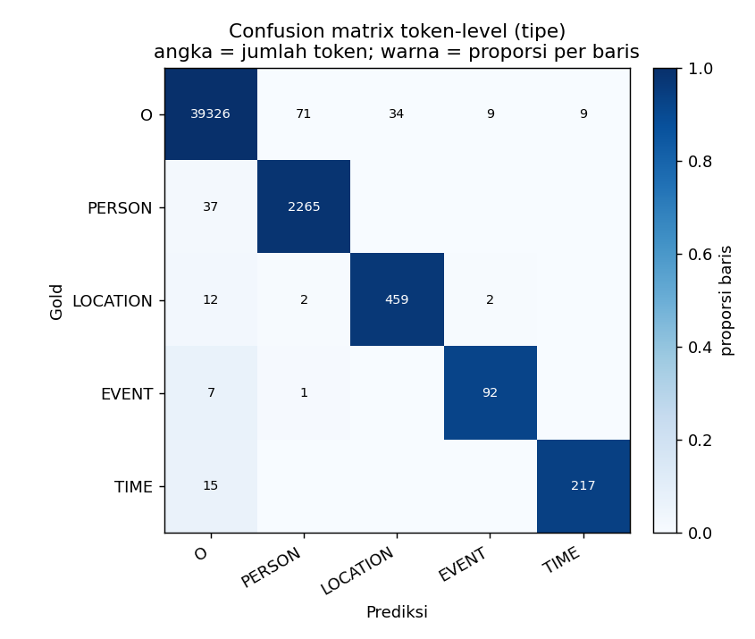

# Deliverable Bimbingan — 11 Juni 2026

> Menindaklanjuti revisi bimbingan **05 Juni 2026**. Fokus deliverable ini: **EDA + Analisis & Pembahasan error NER** (sudah selesai, berbasis data riil). Penambahan skenario (model baru, weighted-CE, POS-tag, parafrase) disajikan sebagai **rancangan + sedang berjalan** (Bagian 4).

**Peta revisi 05 Juni → status di dokumen ini**

| Revisi Bu Diana | Ditangani di | Status |
|---|---|---|
| Tambahkan EDA: info dataset, tahapan pembentukan data, menampilkan data | Bagian 1 | ✅ Selesai |
| Analisis: data rendah di label/kelas apa, kenapa | Bagian 2 | ✅ Selesai |
| Pembahasan: misklasifikasi / tak terdeteksi / per-kalimat 3 vs 2, **kenapa** | Bagian 3 | ✅ Selesai |
| Penambahan skenario: model baru, handle imbalance (weighted-CE/CL/augmentasi), POS-tag | Bagian 4 | 🔄 Rancangan + run awal |
| Klarifikasi: augmentasi vs CL, weighted-CL, parafrase | Bagian 5 | ✅ Dijawab |

Artefak pendukung (file): `data/result/analysis/eda/` dan `data/result/analysis/error_analysis/`.

---

## Bagian 1 — EDA & Informasi Dataset

> Detail + chart: `data/result/analysis/eda/eda_ner_dataset.md`. Script: `src/analysis/eda_ner_dataset.py`.

### 1.1 Tahapan pembentukan data
PDF buku (633 hal.) → **OCR PaddleOCR** → **CSV** → **Preprocessing** → **Chunking** (unit = *chunk* ≈ paragraf ber-`text_id`, total **1.094 chunk**) → **Manual labelling semi-otomatis** (regex + keyword + alias clustering) jadi label BIO 4 kelas → **split** train/test/unlabelled → **BERT iterative self-training** (THRESHOLD 0.9) menambah label pseudo dari `unlabelled`.

### 1.2 Informasi dataset (ukuran)

| Split | Chunk | Token | Avg token/chunk | Entitas (span) | % token entitas |
|---|---:|---:|---:|---:|---:|
| train | 599 | 102.884 | 171,8 | 4.246 | 7,4% |
| test | 258 | 42.558 | 165,0 | 1.759 | 7,3% |
| unlabelled | 237 | 39.207 | 165,4 | — | — |

> **Catatan penting:** `text_id` = **chunk** (bisa berisi beberapa kalimat), bukan kalimat tunggal. Kolom `pos_tag` ada di CSV tapi **semua bernilai `NN` (placeholder)** — POS-tag belum benar-benar dipakai sebagai fitur (relevan untuk skenario POS-tag, Bagian 4).

### 1.3 Distribusi kelas — bukti imbalance

**Test** (1.759 entitas): PERSON 1.189 (67,6%) · LOCATION 449 (25,5%) · **TIME 74 (4,2%)** · **EVENT 47 (2,7%)**.
**Train** (4.246 entitas): PERSON 2.884 (67,9%) · LOCATION 985 (23,2%) · **TIME 233 (5,5%)** · **EVENT 144 (3,4%)**.

→ **Rasio imbalance ≈ 25 : 1** (PERSON : EVENT) di test. EVENT & TIME adalah kelas minoritas.

### 1.4 Menampilkan data (contoh berlabel)
Format `[TIPE: teks]`:
- *"…pasukan **[LOCATION: Makkah]** mulai bergerak menuju **[LOCATION: Madinah]**…"*
- *"…**[PERSON: Rasulullah]** menebus dirinya dan menikahinya pada **[TIME: bulan Sya'ban 6 H]**."*
- *"…tidak ada perbedaan pendapat bahwa **[EVENT: Perang Asafan]** terjadi setelah **[EVENT: Perang Khandaq]**…"*

---

## Bagian 2 — Analisis: Kelas Mana yang Rendah & Kenapa

**F1 per-kelas model pemenang (S3.2 scl-aug iter-4, seqeval entity-level):**

| Kelas | Precision | Recall | F1 | Support (test) |
|---|---:|---:|---:|---:|
| PERSON | 0,9514 | 0,9714 | **0,9613** | 1.189 |
| LOCATION | 0,9395 | 0,9688 | **0,9539** | 449 |
| TIME | 0,8831 | 0,9189 | **0,9007** | 74 |
| **EVENT** | 0,8200 | 0,8723 | **0,8454** | 47 |
| **micro** | 0,9418 | 0,9659 | **0,9537** | 1.759 |
| macro | 0,8985 | 0,9329 | 0,9153 | — |

**Jawaban langsung:** kelas dengan performa terendah = **EVENT (F1 0,845)** lalu **TIME (F1 0,901)**.

**Korelasi dengan jumlah data:** urutan F1 (EVENT < TIME < LOCATION < PERSON) **persis** mengikuti urutan jumlah data (47 < 74 < 449 < 1.189). Ini bukti kuantitatif bahwa **kelangkaan data (few-shot) = faktor utama** performa rendah. Tetapi *kenapa* tidak berhenti di "datanya sedikit" — lihat Bagian 3.

---

## Bagian 3 — Pembahasan: Mengapa Hasilnya Seperti Itu

> Berbasis prediksi ulang test set (258 chunk) dengan model pemenang. Detail: `data/result/analysis/error_analysis/error_analysis_ner.md` + `error_examples.md`. Script: `src/pseudo_labelling/SRL-NER/error_analysis.py`.
> (Catatan metodologis: F1 hitung-ulang = 0,9498 vs resmi 0,9537 — selisih 0,004 wajar karena alignment word-level + windowing; pola error tetap valid.)

### 3.1 Errornya BUKAN misklasifikasi tipe — tapi deteksi

Confusion matrix token-level menunjukkan model **hampir tidak pernah salah tipe**: total hanya **2 token** LOCATION→PERSON, 2 LOCATION→EVENT, 1 EVENT→PERSON di seluruh test set. Artinya **model sudah paham membedakan 4 kelas**. Hampir semua error adalah **entitas ↔ O** (tak terdeteksi atau kelebihan deteksi), bukan tertukar antar-kelas.

Token gold yang "jatuh" ke `O` (tak terdeteksi): PERSON 1,6% · LOCATION 2,5% · **EVENT 7,0% · TIME 6,5%** → kelas minoritas paling sering ke-miss.

### 3.2 Under-deteksi vs over-deteksi per chunk — menjawab "3 entitas terdeteksi 2"

| | Jumlah chunk |
|---|---:|
| Prediksi < gold (**ada entitas ke-miss**) | 18 |
| Prediksi > gold (**kelebihan deteksi**) | 49 |
| Jumlah sama | 191 |

Total entitas: gold **1.759** vs prediksi **1.804**. **Temuan menarik:** kasus yang ditanyakan Bu Diana ("gold 3 terdeteksi 2") memang ada (18 chunk), **tapi yang lebih sering justru kebalikannya** — model menambah entitas yang tidak ada di gold (49 chunk). Penyebabnya (3.3.b) ternyata sebagian bukan kesalahan model.

### 3.3 Lima penyebab konkret (dengan angka & contoh)

**(a) Few-shot kelas minoritas.** EVENT (47) & TIME (74) terlalu sedikit → model kurang generalisasi pada bentuk yang tak terlihat saat training. Konsisten dgn 3.1.

**(b) Inkonsistensi label gold (semi-auto keyed kapitalisasi).** Token `Perang` (huruf kapital) → **40/40 dilabeli EVENT**; token `perang` (huruf kecil) → **26/26 dibiarkan `O`**. Manual labelling regex jelas keyed ke kapitalisasi. Model belajar pola semantik dan **mendeteksi `perang X` huruf kecil sebagai EVENT** (mis. *perang As-Sawiq*, *perang Al-Yamamah*, *perang Mu'tah*) → dihitung **false positive padahal sebetulnya benar**. ⟹ **precision EVENT ter-tekan oleh gold yang tidak konsisten, bukan murni kelemahan model.**

**(c) Artefak OCR → boundary error.** Persentase token entitas gold yang mengandung tanda baca nempel di ujung: **LOCATION 45,7%** · EVENT 28% · TIME 18,5% · PERSON 16,4%. Contoh: `Madinah.`, `Rasulullah,`, token kepecah `Fir aun`/`Dzu Nuwas`, bahkan span gold yang menelan kata kalimat berikutnya (`Rabi'ah bin Umayyah bin **Setelah**`). Ini sumber utama BOUNDARY error (LOCATION paling rentan).

**(d) Entitas langka / low-frequency.** Lokasi obscure (`Ukazh`, `Dzil-Majaz`, `Majinnah`, `Babilon`) dan rantai nasab panjang (`bin Matausyalakh bin Akhnukh`) = *genuine miss* karena nyaris tak muncul di data latih.

**(e) Konteks sitasi/footnote & TIME multi-token.** Event/nama dalam referensi kitab (`Lihat Shahih Al-Bukhari, bab Ghazwah Dzatu Qarad`) sering ke-miss. Ekspresi tanggal panjang (`malam tanggal 21 dari bulan Ramadhan`) → model hanya menangkap sebagian (boundary TIME).

### 3.4 Implikasi penting (jujur)
Sebagian "error" — terutama **false positive EVENT/TIME** dan sebagian boundary — sebenarnya adalah **inkonsistensi/noise anotasi gold**, bukan kelemahan model. Artinya **angka F1 EVENT/TIME riil kemungkinan ter-*underestimate*** oleh gold. Konsekuensi praktis: **memperbaiki konsistensi anotasi** (mis. case-insensitive untuk `perang`, bersihkan tanda baca dari span) bisa menaikkan angka **tanpa mengganti model** — dan ini melengkapi (bukan menggantikan) penanganan imbalance.

---

## Bagian 3b — Audit Manual Labelling (Verifikasi Gold)

> Tindak lanjut: "cek kembali manual labelling agar tidak salah deteksi lagi". Tool read-only `src/manual_labelling/audit_labels.py` → `data/result/analysis/label_audit/`.

**Hasil audit `sirah_prelabelled.csv` (6.005 entitas, 801 chunk):**

| Pemeriksaan | Hasil |
|---|---|
| Offset (`teks[s:e]` = `entity_text`) | **0 mismatch** ✅ |
| Duplikat / overlap span | **0** ✅ |
| Konflik surface→label (1 teks, >1 kelas) | **0** ✅ |
| Tanda baca OCR di ujung span | **0** ✅ (52 apostrof `Isra'`/`Tha'if` = transliterasi sah, bukan error) |
| Entitas mencurigakan (1 huruf/angka) | **0** ✅ |
| **Under-annotation (cakupan)** | **⚠️ ada — ini satu-satunya kelemahan nyata** |

**Kesimpulan: gold tidak salah-label; kelemahannya cakupan (entitas ke-skip), akibat manual labelling berbasis regex.**
- **Kapitalisasi:** `Perang X` (kapital) **162/162 ter-label EVENT**; `perang X` (huruf kecil) **10/10 TIDAK ter-label**. Akar: `pre_labelling.py:_EVENT_PERANG_RE` mensyaratkan huruf kapital.
- **Bentuk di luar kata-kunci:** kata event/waktu yang dipakai bukan dalam pola exact-keyword sering ke-skip — mis. `hijrah` ter-label 4/85, `ramadhan` 2/33, `badr` 22/74. *(Catatan: angka ini kandidat, ada noise — sebagian kemunculan adalah kata umum / bagian nama lebih panjang; perlu review manual.)*
- **Boundary/tanda baca yang mengganggu model ternyata BUKAN dari gold**, tapi dari tokenisasi spasi di `prepare_bert_data.py` (`Madinah.` jadi satu token). ⟹ bisa diperbaiki di tahap tokenisasi **tanpa re-anotasi**.

**Implikasi:** sebagian "error" EVENT/TIME memang mencerminkan **cakupan gold**, bukan kelemahan model. Memperbaikinya = meningkatkan **konsistensi cakupan anotasi**.

### Perbaikan gold yang sudah diterapkan (additive, by-rule)

Diterapkan fix **defensible & konsisten metodologi**: regex EVENT dibuat **case-insensitive** + tambah trigger `Sariyah` (`src/manual_labelling/improve_event_coverage.py`, additive — tidak menghapus/mengubah label lama, backup `.bak_eventcov`). Hasil: **+8 EVENT** (`perang As-Sawiq`, `perang Al-Yamamah`, `perang Mu'tah` ×4, `perang Bani Quraizhah/Nadhir`) → EVENT 191→199 di gold; train/test di-regenerate dengan **split identik** (terverifikasi struktur token tak berubah, hanya 8 label O→EVENT).

**Dampak ke evaluasi (model pemenang yang SAMA, tanpa re-train — murni efek koreksi gold; angka official `evaluate_seqeval.py`):**

| Metrik | Gold lama | Gold dikoreksi | Δ |
|---|---:|---:|---:|
| EVENT precision | 0,820 | **0,900** | **+0,080** |
| EVENT F1 | 0,845 | **0,891** | **+0,046** |
| Macro F1 | 0,915 | **0,927** | **+0,011** |
| Micro F1 | 0,9537 | **0,9549** | +0,001 |

→ 4 "perang X" yang dulu dihitung *false positive* kini jadi *true positive*. **Membuktikan kuantitatif bahwa sebagian kelemahan EVENT = bug anotasi, bukan model.**

**Semua skenario di-re-evaluasi di gold dikoreksi** (tabel lengkap: `data/result/pseudo-labelling/SRL-NER/seqeval_results.md`). Efek koreksi terlihat di semua model — mis. **S1 baseline EVENT F1 0,768 → 0,816**, S3.2 winner 0,845 → 0,891. Urutan skenario tidak berubah (S3.2 tetap winner; augmentasi tetap pengungkit EVENT terbesar).

*(TIDAK dilakukan mass-add `hijrah`/`ramadhan` karena mayoritas = kata umum / sudah ter-cover span lain → akan menambah noise. Skala EVENT yang kecil tetap perlu solusi LLM verb extraction — lihat future work.)*

> Catatan: re-train penuh (model belajar 4 event baru di train) memberi tambahan marjinal. Re-evaluasi semua skenario di gold dikoreksi **tidak butuh GPU** (inferensi saja).

---

## Bagian 4 — Penambahan Skenario (Rancangan + Sedang Berjalan)

Temuan Bagian 3 mengarahkan prioritas: karena masalah utama = **few-shot minoritas + deteksi (bukan tipe)**, teknik **menambah/menyeimbangkan data** paling relevan. **Lineup skenario dikunci 2026-06-09** (detail + kode siap-paste: `../skenario/skenario_baru_2026-06.md`). Semua dilatih di **gold dikoreksi**; training penuh = **pasca-11-Juni** (banyak run GPU).

**Grup A — Penanganan imbalance** (backbone IndoBERT, head-to-head di test sama):
| Kode | Skenario | Yang diuji | Asal |
|---|---|---|---|
| S1 | Baseline | tanpa penanganan | lama ✓ |
| S2 | **Weighted Cross-Entropy** (bobot *tempered*) | pembobotan loss | **baru** |
| S3 | Contrastive Learning (SCL λ=0.3) | bentuk representasi | lama ✓ |
| S4 | Augmentation (mention replacement) | tambah data riil | lama ✓ (winner) |

**Grup B — Backbone:** IndoBERT (cased) vs `cahya/bert-base-indonesian-1.5G` (uncased) vs `cahya/distilbert-base-indonesian` (uncased). **Grup C — Ablation POS-tag:** dengan vs tanpa POS riil.

> **Catatan jujur weighted-CE:** class weighting **pernah dicoba** (legacy 2026-05-07) → precision kolaps (bobot ekstrem). S2 baru pakai **bobot sqrt-tempered** (`class_weights.json`), bukan balanced mentah.
>
> **Catatan backbone (nyambung temuan 3.3.b):** model `cahya` **uncased** → menghilangkan sinyal kapital. Justru jadi ablation menarik: seberapa besar NER bergantung pada kapitalisasi (yang sebagian artifak gold) vs konteks. (Model terverifikasi ada di HF.)
>
> **Catatan POS-tag:** kolom `pos_tag` sekarang masih placeholder `NN` → perlu generate POS riil (Stanza) dulu sebelum ablation.

Evaluasi semua: **F1 macro + F1 EVENT/TIME** (bukan hanya micro), karena target = menggerakkan kelas minoritas.

---

## Bagian 5 — Klarifikasi Konsep (menjawab pertanyaan Bu Diana)

- **"Augmentasi nambah data riil, CL mirip pembobotan"** — benar dan keduanya **komplementer**, bukan redundan:
  - **Augmentasi** menambah *jumlah contoh* train (data riil baru) → langsung melawan few-shot.
  - **Contrastive Learning (CL)** **tidak** menambah data; ia **membentuk ruang representasi** (menarik token sekelas berdekatan, mendorong antar-kelas menjauh) — efeknya mirip *reweighting* penekanan, bukan penambahan data.
  - Bukti di proyek: CL sendiri (S2) **tidak** menggerakkan kelas minoritas; baru setelah **augmentasi** (S3.2) F1 EVENT melonjak +0,0746. Ini konsisten dengan penjelasan Bu Diana.
- **"Apakah bobot CL perlu weighted?"** — pertanyaan desain yang valid. Saat ini λ_C = 0,3 adalah bobot **global** pada loss contrastive, **bukan per-kelas**. Bisa diuji varian **weighted-CL**: beri bobot lebih besar pada pasangan yang melibatkan kelas minoritas (EVENT/TIME) di dalam loss contrastive — sejajar dengan ide weighted-CE tapi di ruang representasi. Kandidat skenario tambahan (akan ditambahkan ke Bagian 4 jika disetujui).

---

## Lampiran — Daftar Artefak

| File | Isi |
|---|---|
| `src/analysis/eda_ner_dataset.py` | Script EDA |
| `data/result/analysis/eda/eda_ner_dataset.md` | Laporan EDA + 2 chart |
| `src/pseudo_labelling/SRL-NER/error_analysis.py` | Script error analysis |
| `data/result/analysis/error_analysis/error_analysis_ner.md` | Confusion matrix, breakdown span, count per-chunk |
| `data/result/analysis/error_analysis/error_examples.md` | Contoh konkret tiap kategori error |
| `data/result/analysis/error_analysis/test_predictions.csv` | Prediksi token-level gold vs pred (untuk audit) |
