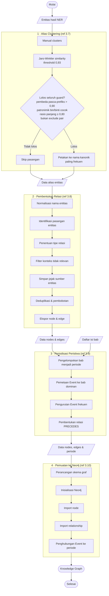

# Perbaikan Diagram — Slide 11 "Konstruksi Knowledge Graph"

**Masalah:** flowchart lama (`docs/bab3/flowchart/3.10. Konstruksi Knowledge Graph dengan Neo4j`) hanya menggambar **tahap terakhir** (pemuatan ke Neo4j). Ia mulai dari *"Data Nodes, Edges, dan Periode"* yang dianggap **sudah jadi**, sehingga tiga tahap awal yang disebut di konten slide — **Alias Clustering → Pembentukan Relasi → Periodisasi** — tidak terlihat.

**Perbaikan:** diagram harus merangkai keempat tahap sesuai konten slide dan sesuai flowchart per-tahap yang sudah ada di `docs/bab3/flowchart/` (3.7, 3.8, 3.9, 3.10).

Referensi sumber tiap tahap:
- Tahap 1 — `3.7. Alias Clustering.png`
- Tahap 2 — `3.8. Pembentukan Relasi.drawio.png`
- Tahap 3 — `3.9. Periodisasi Peristiwa.png`
- Tahap 4 — `3.10. Konstruksi Knowledge Graph dengan Neo4j.drawio.png` (yang lama = ini saja)

---

## A. Versi RINGKAS (pakai ini untuk slide)

Empat tahap sebagai pipeline, dengan artefak data (parallelogram) mengalir antar-tahap.

```mermaid
flowchart LR
    A(["Mulai"]) --> B[/Entitas hasil NER/]
    B --> C["1 · Alias Clustering<br/>manual + Jaro-Winkler 0,93"]
    C --> D[/Data alias entitas/]
    D --> E["2 · Pembentukan Relasi<br/>co-occurrence, tipe relasi, pembobotan"]
    E --> F[/Data nodes & edges/]
    F --> G["3 · Periodisasi Peristiwa<br/>Event ke periode P0-P14, relasi PRECEDES"]
    G --> H[/Data nodes, edges & periode/]
    H --> I["4 · Pemuatan ke Neo4j<br/>skema graf, import node & edge, Event ke periode"]
    I --> J(["Knowledge Graph"])
```

---

## B. Versi DETAIL (referensi — gabungan sub-langkah keempat flowchart)

Kalau ingin diagram penuh (mis. untuk Bab 3 atau slide backup), rangkaikan sub-langkah asli tiap tahap:

---

## Catatan penerapan

- Untuk **slide**, versi **A (ringkas)** paling pas — 4 kotak proses + artefak, terbaca sekilas, dan cocok dengan 4 blok teks yang sudah ada di slide 11.
- Kalau kamu mau tetap pakai gaya **draw.io** (agar seragam dengan Bab 3), tinggal gambar ulang mengikuti struktur versi A/B ini; mermaid di sini sebagai spesifikasi alur, bukan wajib jadi format akhir.
- Perubahan inti dari diagram lama: **tambahkan Tahap 1–3 di depan**, dan turunkan blok Neo4j lama menjadi **Tahap 4** saja.
